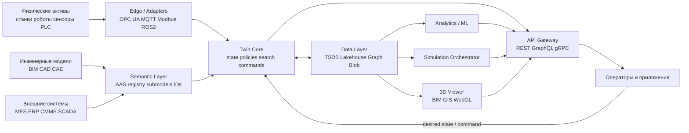
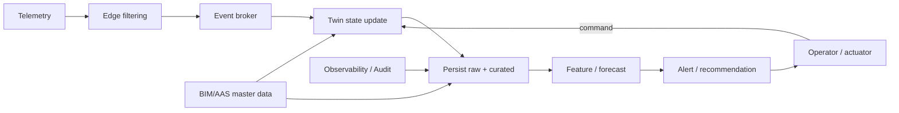

# GitHub-first исследование по цифровым двойникам и проектной архитектуре

## Система

По GitHub-теме `digital-twin` сейчас видно 938 публичных репозиториев; по языкам среди них особенно заметны Python, TypeScript, JavaScript, C# и C++. Отдельная тема `asset-administration-shell` существенно уже — 24 публичных репозитория. Это важный архитектурный сигнал: широкий ландшафт цифровых двойников очень фрагментирован, а слой семантической интероперабельности и стандартизации пока сосредоточен в сравнительно небольшом ядре проектов. citeturn43view0turn42view0

Если смотреть на GitHub не как на каталог, а как на «рентген» архитектурных решений, экосистема распадается на несколько устойчивых классов:  
платформенное ядро twin-state и policy, семантический слой AAS, edge/IoT-интеграцию, визуализацию BIM/GIS/3D, слой симуляции и слой аналитики/what-if. Наиболее архитектурно ценные репозитории в этой выборке — не обязательно самые «звёздные»: например, CARLA и Gazebo доминируют как симуляторы, но именно Ditto, BaSyx и FAAAST дают наиболее полезные паттерны для построения промышленного проекта цифрового двойника. citeturn38view0turn39view1turn23view0turn38view2turn39view0turn24view0turn42view0turn24view5turn27view5turn24view4turn27view4

Дополнительно ваш загруженный markdown полезен как мета-ограничение для архитектуры: сырые события и журналы не должны напрямую становиться устойчивым слоем идентичности/состояния; между ними нужен слой нормализации, консолидации и устойчивой семантики. Это хорошо совпадает с тем, как устроены сильные twin-репозитории на GitHub. fileciteturn0file0

## Репозитории GitHub

Ниже — **все репозитории, найденные в рамках этого GitHub-first обзора и прошедшие порог архитектурной релевантности**. Если GitHub в доступной HTML-выгрузке не отдал часть метрик, я честно отметил поле как **«не извлечено»**.

| Имя | Ссылка | Краткое описание | Ключевые технологии | Звезды | Форки | Последний коммит / доступная активность | Архитектурная документация | Релевантность |
|---|---|---|---|---:|---:|---|---|---|
| Eclipse Ditto | `eclipse-ditto/ditto` citeturn38view0turn39view1turn9view1turn23view0 | Платформенное ядро цифрового двойника для IoT: twin state, policies, search, connectivity | Java, JavaScript, MQTT, Kafka, AMQP, HTTP, MongoDB, WoT | 892 | 275 | 2026-04-10 | да | очень высокий |
| Eclipse BaSyx Java V2 SDK | `eclipse-basyx/basyx-java-server-sdk` citeturn38view2turn39view0turn8view0 | AAS-совместимые V2-компоненты для AAS V3, репозитории, registry, discovery, сервисы | Java, AAS V3, MQTT, Docker, MongoDB/InMemory | 85 | 70 | 2025-12-08 | да | очень высокий |
| FAAAST Service | `FraunhoferIOSB/FAAAST-Service` citeturn24view0turn25view0turn27view0turn42view0 | AAS-сервис Fraunhofer для цифровых двойников с docs, messagebus и endpoint-слоями | Java, AAS, OPC UA, docs, Docker, message bus | 88 | 16 | 2026-02-27 | да | очень высокий |
| Shifu | `Edgenesis/shifu` citeturn41view0turn43view0 | Kubernetes-native IoT gateway; DeviceShifu выступает как цифровой двойник устройства | Go, Kubernetes, edge, MQTT, OPC UA, RTSP, TCP, CRD | 1.4k | 136 | 2026-06-03 | да | очень высокий |
| Eclipse Milo | `eclipse-milo/milo` citeturn24view6turn25view6turn27view6turn35view2 | Open-source реализация OPC UA со stack + client/server SDK | Java, OPC UA, IEC 62541, client/server SDK | 1.4k | 472 | 2026-05-18 | да | высокий |
| iTwin.js | `iTwin/itwinjs-core` citeturn38view1turn39view2turn40view0 | Open-source библиотека для инфраструктурных digital twins, агрегирует engineering models, reality data, GIS и IoT | TypeScript, WebGL, BIM, GIS, IoT, Rush monorepo | 717 | 239 | 2026-06-05 | да | очень высокий |
| xeokit SDK | `xeokit/xeokit-sdk` citeturn24view3turn25view3turn27view3turn33view2 | WebGL/BIM viewer SDK для браузерной визуализации инженерных и IFC-моделей | JavaScript, WebGL, BIM, IFC, browser 3D | 905 | 329 | 2026-05-27 | да | высокий |
| Gazebo Sim | `gazebosim/gz-sim` citeturn24view4turn25view4turn27view4turn30view0turn35view0 | Открытый робототехнический симулятор, актуальная версия Gazebo | C++, ROS/ROS2, physics, rendering, plugins | 1.4k | 419 | 2026-05-07 | да | высокий |
| CARLA | `carla-simulator/carla` citeturn24view5turn25view5turn27view5turn31view1 | Open-source симулятор автономного вождения с цифровыми ассетами, сенсорами и условиями среды | C++, Python, Unreal, ROS2, sensors | 14k | 4.6k | не извлечено; latest tag 0.9.16 — 2025-09-16 | да | высокий |
| Project Chrono | `projectchrono/chrono` citeturn24view8turn25view8turn27view7turn31view0 | Многотельная и мультифизическая симуляция; есть шаблоны co-sim и ROS/FMI-проектов | C++, multibody, multiphysics, ROS, FMI2, vehicle co-sim | 2.9k | 601 | 2025-11-10 | да | высокий |
| NOS3 | `nasa/nos3` citeturn24view9turn25view9turn27view8turn35view3 | Набор NASA для software development, I&T, V&V, dynamics/environment simulation и hardware models | C, spacecraft simulation, dynamics, readthedocs | 580 | 146 | 2026-06-05 | да | высокий |
| Mnestix Browser | `eclipse-mnestix/mnestix-browser` citeturn24view1turn25view1turn27view1turn42view0 | Браузер AAS для старта работы с Asset Administration Shell и просмотра репозиториев | TypeScript, AAS, Docker, docs, browser UI | 83 | 19 | 2026-02-26 | да | высокий |
| Azure AAS Digital Factory | `Azure-Samples/aas-digital-factory` citeturn24view2turn25view2turn27view2turn42view0 | Пример представления фабрики в Azure Digital Twins через AAS ontology | C#, Azure Digital Twins, Event Hubs, Azure Functions, Terraform | 7 | 2 | 2023-02-23 | да | средний |
| PartCAD | `partcad/partcad` citeturn43view0 | Digital thread / TDP для документирования и сопровождения физических изделий | Python, CAD, STEP, IGES, digital thread | 467 | не извлечено | 2025-10-01 | не извлечено | средний |
| PathSim | `pathsim/pathsim` citeturn43view0 | Python-native фреймворк моделирования динамических систем по block-diagram paradigm | Python, simulation, control systems, ODE, block diagrams | 386 | не извлечено | 2026-05-27 | не извлечено | средний |
| opendigitaltwins-assetadminstrationshell | `JMayrbaeurl/opendigitaltwins-assetadminstrationshell` citeturn42view0 | DTDL v2-реализация ontology Asset Administration Shell | C#, DTDL, AAS ontology, manufacturing | 36 | не извлечено | 2022-12-13 | не извлечено | средний |
| node-opcua-coreaas | `OPCUAUniCT/node-opcua-coreaas` citeturn42view0 | Расширение node-opcua с реализацией CoreAAS Information Model | TypeScript, Node.js, OPC UA, CoreAAS | 21 | не извлечено | 2022-08-30 | не извлечено | средний |
| AASPortal | `eclipse-aasportal/AASPortal` citeturn42view0 | Node.js web portal для визуализации и управления Asset Administration Shell | TypeScript, Node.js, AAS portal | 13 | не извлечено | 2026-03-01 | не извлечено | средний |

Главный вывод по таблице такой: **архитектурный центр тяжести проекта цифрового двойника лежит не в одном репозитории, а в композиции**. Ditto даёт паттерн runtime twin-state и политики доступа, BaSyx/FAAAST/Mnestix — AAS-семантику и интероперабельность, Shifu/Milo — edge и протокольную интеграцию, iTwin/xeokit — визуализацию, Gazebo/CARLA/Chrono/NOS3/PathSim — модельную и гибридную симуляцию. citeturn23view0turn39view0turn24view0turn27view1turn41view0turn27view6turn39view2turn27view3turn27view4turn27view5turn27view7turn27view8turn43view0

## Контракты и архитектурные паттерны

Если собрать общий рисунок из README, official docs и topic pages, возникают пять паттернов, которые повторяются сильнее всего.

Первый паттерн — **event-driven twin core**. У Ditto цифровой двойник проектируется как набор сущностей и сигналов: Things, Policies, Commands, Events, search и subscriptions; платформа поддерживает synchronous/asynchronous APIs, разделение desired/reported/current state и интеграцию через MQTT, Kafka, HTTP и AMQP. Это делает его не «базой данных устройств», а именно runtime-слоем цифрового двойника. citeturn22view0turn23view0turn39view1

Второй паттерн — **семантика как отдельный слой, а не атрибут JSON-сущности**. IDTA прямо определяет AAS как основу стандартизованного digital twin, а набор спецификаций включает метамодель, API, security и package format. BaSyx, FAAAST, Mnestix и связанные AAS-репозитории строятся именно вокруг этой идеи: сначала семантический контракт, потом реализация хранения, registry/discovery, submodels и UI. citeturn22view2turn22view3turn39view0turn42view0

Третий паттерн — **device abstraction на edge**. Shifu особенно важен тем, что называет DeviceShifu цифровым двойником устройства и связывает twin-представление с протоколами HTTP, MQTT, RTSP, Siemens S7, TCP socket и OPC UA. В сочетании с Milo как зрелой реализацией OPC UA это даёт очень сильный архитектурный вывод: протоколы и драйверы не должны протекать в бизнес-домен, они должны быть закрыты адаптерным слоем. citeturn41view0turn27view6turn35view2

Четвёртый паттерн — **визуализация не равна twin core**. iTwin.js агрегирует engineering models, reality data, GIS и IoT и умеет показывать 3D/4D; xeokit делает то же в более лёгком web-centric варианте для BIM/IFC. Но ни iTwin.js, ни xeokit не заменяют twin-state и semantic contract: они должны сидеть поверх ядра, а не становиться «источником истины». citeturn39view2turn27view3

Пятый паттерн — **симуляция должна быть plug-in слоем и жить рядом с twin runtime, а не внутри него**. Gazebo специализируется на робототехнической динамике и плагинах; CARLA — на сенсорах, дорожной среде и автономном вождении; Chrono — на multibody/multiphysics и co-sim; NOS3 — на aerospace V&V, I&T и software-based hardware models; PathSim — на блочно-диаграммной симуляции динамических систем. Это означает, что единый «универсальный движок цифрового двойника» — плохая идея: симулятор надо менять по домену, а twin contracts оставлять стабильными. citeturn27view4turn27view5turn27view7turn27view8turn43view0

Из этих паттернов получается контрактная модель проекта:

- **Контракт устройства**: OPC UA, MQTT, ROS 2, HTTP/REST, file/batch ingest.
- **Контракт семантики**: AAS submodels, concept descriptions, stable asset IDs, versioned schemas.
- **Контракт twin runtime**: thing/feature/policy, desired/reported/current state, command/event/search API.
- **Контракт данных**: timeseries, event lineage, 3D/BIM payloads, ML features, provenance.
- **Контракт управления**: IAM, RBAC/ABAC, audit, retention, deletion, change provenance.

Именно такая декомпозиция лучше всего согласуется и с GitHub-репозиториями, и с ISO 23247, и с IDTA AAS. citeturn22view2turn22view3turn23view0turn39view0

## Предлагаемая архитектура проекта

Моя рекомендуемая архитектура — **гибрид “Ditto-like runtime + AAS semantic backbone + domain simulator plug-ins + 3D/ops applications”**. Это не «собрать всё из open-source как есть», а взять из GitHub сильнейшие устойчивые паттерны и собрать их в проектный blueprint.

[SVG-версия](sandbox:/mnt/data/dt_arch_high_level.svg) · [PNG-версия](sandbox:/mnt/data/dt_arch_high_level.png)

На уровне технологии выбор выглядит так:

- **Twin core**: логика по образцу Eclipse Ditto — state, policy, search, subscriptions, commands.  
- **Semantic backbone**: AAS через BaSyx / FAAAST / IDTA submodels.  
- **Edge & protocol**: Shifu-подобный слой + OPC UA через Milo + MQTT как основной edge transport.  
- **3D/BIM/GIS**: iTwin.js для инфраструктурных сценариев, xeokit — для web-centric IFC/BIM.  
- **Simulation**: Gazebo/ROS2 для робототехники, CARLA — для транспортных сценариев, Chrono — для мультифизики и co-sim, NOS3 — для aerospace/mission ops, PathSim — для block-diagram cases.  
- **Security & governance**: resource-based access control и security-by-contract по образцу Ditto + AAS Part 4 Security. citeturn23view0turn39view0turn24view0turn41view0turn27view6turn39view2turn27view3turn27view4turn27view5turn27view7turn27view8turn22view2

[SVG-версия](sandbox:/mnt/data/dt_arch_components.svg) · [PNG-версия](sandbox:/mnt/data/dt_arch_components.png)

### Mermaid-представление высокой архитектуры

### Mermaid-представление потока данных

[SVG-версия](sandbox:/mnt/data/dt_arch_flow.svg) · [PNG-версия](sandbox:/mnt/data/dt_arch_flow.png)

### Почему эта архитектура сильная

Она хорошо разделяет надсистему на независимые слои ответственности:  
**физика и телеметрия**, **semantic contract**, **operational twin runtime**, **data/knowledge**, **apps/analytics/simulation**. Такой разрез лучше масштабируется, чем монолитный “IoT platform + dashboard”, потому что отдельно эволюционируют протоколы подключения, отдельно — нормативная семантика AAS, отдельно — twin-state, отдельно — модели и визуализация. Именно это видно в Ditto, BaSyx, FAAAST, Shifu, iTwin и в smart-city работе Snap4City. citeturn23view0turn39view0turn24view0turn41view0turn39view2turn37academia1

### Слабые места и альтернативы

Слабое место такого подхода — рост интеграционной сложности: появляется больше контрактов, больше схем, больше мест, где можно получить schema drift. Если нужен **очень быстрый MVP** с минимальным межсервисным разрезом, то можно начать с более компактного варианта: один operational twin service, один AAS registry/repository, один TSDB, один viewer и один simulator adapter. Но важно не смешивать twin runtime с 3D viewer и не зашивать протоколы устройств внутрь бизнес-логики — это почти гарантированно создаст архитектурный долг. citeturn23view0turn39view0turn41view0

## Приоритет и план реализации

Ниже — **моя проектная оценка**, а не цитата из внешнего источника. Я исхожу из команды 3–5 инженеров, доменного владельца и одного архитектора/tech lead.

| Этап | Содержание | Трудозатраты, часы | Риск | Критерий готовности |
|---|---|---:|---|---|
| Discovery и контракты | use cases, asset taxonomy, event model, AAS-модель, SLA/SLO | 40–80 | средний | утверждены границы системы и ключевые контракты |
| Semantic backbone | AAS registry, submodels, master data, ID/version strategy | 80–140 | высокий | активы и submodels версионированы и доступны по API |
| Edge ingestion | OPC UA/MQTT/ROS2 adapters, buffering, retry, idempotency | 100–180 | высокий | телеметрия и команды проходят end-to-end |
| Twin core | state, policies, search, subscriptions, command workflow | 120–200 | высокий | twin runtime стабильно обслуживает state transitions |
| Data layer | lake/TSDB/graph/blob, lineage, observability | 80–160 | средний | есть replay, traceability, searchable history |
| Viewer и операционный UI | 3D/IFC/BIM/GIS, dashboards, asset drill-down | 80–160 | средний | пользователь видит состояние twin + контекст |
| Analytics и simulation | anomaly/prediction/what-if, simulator orchestration | 120–240 | высокий | работает хотя бы один полезный scenario loop |
| Hardening | CI/CD, security, backup/DR, perf/load, runbooks | 80–140 | высокий | staging и production readiness |

**Итого для MVP**: примерно **700–1 300 часов**.  
**Итого для production-grade первой версии**: примерно **1 100–1 800 часов**.

С точки зрения приоритета я бы шёл так:

1. **Сначала semantic backbone + twin core**. Без этого всё остальное превращается в набор разрозненных интеграций.
2. **Потом edge ingestion и наблюдаемость**. Twin без надёжного ingest — это demo, а не система.
3. **Потом viewer/UI**. Пользовательская ценность должна появиться рано, но не раньше, чем есть стабильный state contract.
4. **Потом analytics/simulation**. Их лучше строить как consumers стабильной модели, а не как архитектурный «центр».  

Это хорошо совпадает и с GitHub-ландшафтом: семантика и twin runtime менее популярны по stars, но именно они дают больше всего архитектурной устойчивости. citeturn38view0turn39view0turn24view0turn43view0turn42view0

## Риски, лицензирование и DevSecOps

### Лицензирование

Если вы строите собственную платформу и хотите максимальную свободу для enterprise-дистрибуции, оптимальный выбор для **вашего собственного backend-ядра** — обычно **Apache-2.0**. Она хорошо сочетается с рядом релевантных проектов экосистемы и удобна для корпоративного adoption. В текущей выборке есть и другие режимы: Ditto — EPL-2.0, Mnestix и CARLA — MIT, Gazebo — Apache-2.0, Chrono — BSD-3-Clause, xeokit — AGPL-3.0. Последнее особенно важно: **AGPL-3.0 у xeokit — архитектурное, а не только юридическое ограничение**, поэтому его надо либо принимать сознательно, либо заменять на другой viewer-слой в коммерческом SaaS-контуре. citeturn39view1turn26view1turn26view5turn26view4turn26view8turn26view3

### CI/CD

Сильный baseline для GitHub-first проекта здесь такой:

- monorepo или federated monorepo только если действительно много shared contracts;
- обязательные contract tests для event schemas и AAS submodels;
- unit + integration + simulator-in-the-loop;
- GitHub Actions для build/test/security gates;
- SBOM, container scanning, dependency scanning, secret scanning, signed artifacts;
- progressive delivery: dev → staging → shadow/ghost traffic → prod.

Такой подход поддерживается не только best practice, но и самим ландшафтом открытых репозиториев: у Ditto видны deployment/devops-слои и monitoring & tracing в документации; у Shifu есть `.github`, `azure-pipelines`, docs и examples; у CARLA — `Jenkinsfile`; у FAAAST в репозитории есть `owaspSuppressions.xml`, `charts`, `docs`; у xeokit — Playwright и security policy. Отдельно важно, что в исследовании по Digital Twin Prototypes цифровые twin-прототипы прямо рассматриваются как средство автоматизированного тестирования в CI/CD pipelines. citeturn23view0turn41view0turn27view5turn24view0turn26view0turn26view3turn37academia0

### Тестирование

Для проекта цифрового двойника я рекомендую четыре обязательных контура тестов:

- **contract tests** на входные протоколы и семантические схемы;
- **state-transition tests** на twin runtime;
- **replay tests** на исторической телеметрии;
- **simulation/HIL/SIL tests** там, где есть физическое поведение или управление.

Эта рекомендация напрямую вытекает из репозиториев симуляции и V&V: Gazebo и CARLA задают сильный simulation loop, NOS3 построен вокруг software development, integration & test, mission operations/training и verification & validation, а работа по Digital Twin Prototypes делает автоматизированную верификацию одним из ключевых сценариев. citeturn27view4turn27view5turn27view8turn37academia0

### Безопасность и масштабируемость

Безопасность в цифровом двойнике нельзя оставлять на уровне “TLS + пароль”. Ditto explicitly строит fine-grained resource-based access control, а в документации есть TLS certificates, SSH tunneling и HMAC signing. IDTA отдельно публикует AAS Part 4 Security. Отсюда мой вывод: делайте security contract-first — per-device identity, per-twin policy, audit log, immutable provenance для команд и разделение control plane / data plane. citeturn22view0turn23view0turn22view2

По масштабируемости критичны три решения.  
Во-первых, **idempotent ingest** и повторяемое воспроизведение событий.  
Во-вторых, **разделение горячего twin-state и тяжёлой аналитики**.  
В-третьих, **семантическое versioning** моделей активов, чтобы не ломать приложения при смене submodels.  
Это не просто абстрактные советы: Ditto, BaSyx и AAS-экосистема уже разбивают ответственность именно таким образом, а Shifu показывает, как отделять device-adapter уровень от application logic. citeturn23view0turn39view0turn41view0

### Метрики, которые реально стоит внедрить

Я бы измерял не только latency и uptime, но и более специфические twin-метрики:

- ingest lag по каждому протоколу;
- freshness twin-state;
- command success rate и rollback rate;
- schema/version drift;
- coverage AAS submodels;
- search precision по asset graph;
- 3D model load time и scene interaction latency;
- sim2real gap;
- policy denial rate и audit completeness.

Это уже не цитата из внешнего источника, а моя инженерная рекомендация на основе структуры найденных репозиториев и стандартов.

## Первоисточники и ограничения

Основные первоисточники, на которых держится этот отчёт:

- **Eclipse Ditto official site** и **Architecture overview** — про twin state, APIs, connectivity и security. citeturn22view0turn23view0
- **IDTA AAS Specifications** — про метамодель, API, security и AASX как основу стандартизованного digital twin. citeturn22view2
- **ISO 23247-1:2021** — официальный обзор и общие принципы digital twin framework for manufacturing. citeturn22view3
- **README и файлы репозиториев GitHub** из таблицы — как первичный источник по архитектуре, лицензиям, стеку и зрелости. citeturn38view0turn39view0turn24view0turn41view0turn39view2turn27view3turn27view4turn27view5turn27view7turn27view8turn27view6
- **Snap4City paper** — полезен как внешний контрольный пример real-time multi-data integration и what-if analysis в smart-city digital twin. citeturn37academia1
- **From Digital Twins to Digital Twin Prototypes** — важен для CI/CD и automated validation логики. citeturn37academia0

### Ограничения

Этот отчёт **не является полным зеркалом всех 938 GitHub-репозиториев по теме `digital-twin`**. Это GitHub-first обзор с порогом архитектурной релевантности и с приоритетом на репозитории, по которым удалось извлечь сопоставимые метрики и признаки прямо из GitHub/official docs. На некоторых страницах GitHub commit date в доступной HTML-выгрузке не был доступен; такие поля я пометил как `не извлечено`, либо использовал ближайшую доступную GitHub-активность. citeturn43view0turn42view0

Если сжать всё до одного инженерного решения, то оно такое: **строить проект цифрового двойника нужно не как “IoT-платформу с красивым 3D”, а как композицию из semantic backbone, twin runtime, edge abstraction, model/simulation plug-ins и управляемого data/knowledge слоя**. Именно это решение лучше всего подтверждается и GitHub-экосистемой, и официальными стандартами. citeturn23view0turn22view2turn22view3turn41view0turn39view2