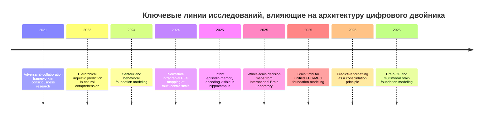
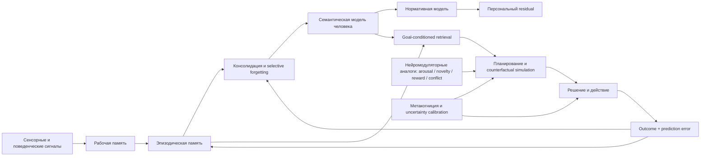
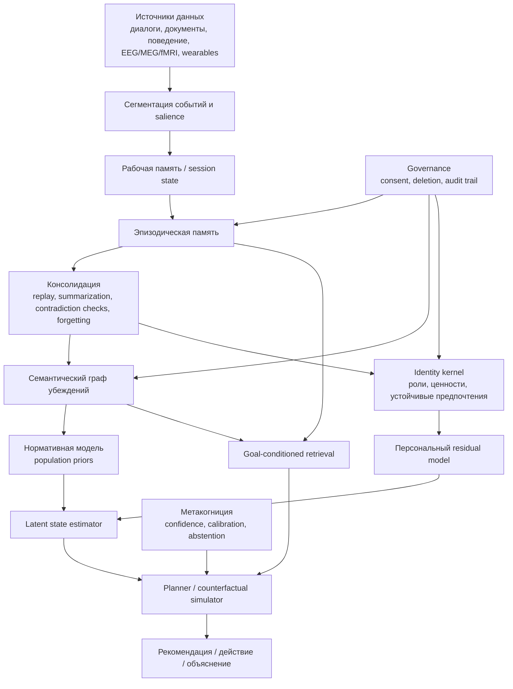

# Современные исследования о работе человеческого мозга, релевантные для цифрового двойника

## Executive summary

Главный вывод исследования такой: для цифрового двойника наиболее полезна не идея «полной копии мозга», а **гибридная архитектура**, которая соединяет четыре слоя — персонализированную эпизодическую память, медленно меняющуюся семантическую модель человека, динамическую модель латентных когнитивных состояний и модуль принятия решений с явной неопределённостью. Современная нейронаука всё сильнее показывает, что мозг не работает как единая база данных или один «центральный процессор»: память реконструктивна и распределена; решения формируются широко распределёнными сетями, а не только одной «зоной выбора»; внимание и восприятие тесно связаны с предсказаниями; а индивидуальные различия лучше описываются через нормативные модели и персональные отклонения от них, чем через один усреднённый шаблон. citeturn33news1turn1academia1turn21news2turn14academia3turn40academia0turn40academia4turn38academia0

Для цифрового двойника это означает следующее. Во-первых, «память twin-а» должна быть многоуровневой: кратковременный рабочий буфер, эпизодическое хранилище событий, слой консолидации и отдельный слой устойчивых убеждений/ценностей. Во-вторых, twin должен моделировать не только прошлое, но и **будущие симуляции**: люди принимают решения, опираясь на воспоминания, прогнозы, prior beliefs и нейромодуляторно-зависимую оценку значимости. В-третьих, архитектура должна быть персонализированной, но не полностью идiosyncratic: лучший компромисс — **нормативная модель + персональный residual**, то есть «что типично для популяции» плюс «чем именно этот человек отклоняется от нормы». В-четвёртых, если у twin-а нет слоя калибровки уверенности и контроля дрейфа идентичности, он быстро превращается в убедительного, но недостоверного имитатора. citeturn14academia4turn19academia1turn37academia1turn40academia0turn40academia4turn40news5turn5academia4

Самые сильные прикладные сигналы за 2019–2026 годы идут из нескольких линий работ. У младенцев уже к 12 месяцам появляется hippocampal-зависимое кодирование rudimentary episodic memories, что поддерживает тезис о раннем возникновении механизмов памяти и более поздней проблеме их консолидации/извлечения. Появились сильные аргументы в пользу того, что offline-consolidation и selective forgetting не побочный эффект, а функция, оптимизирующая обобщение. Большие нейрокартографические проекты показали, что решение задач распределено по значительно большей части мозга, чем предполагали линейные модели «сенсорика → PFC → моторика». Одновременно foundation-модели для EEG/MEG/fMRI и поведенческие foundation-модели вроде Centaur открывают практический путь к гибридным цифровым двойникам: не «симулировать весь мозг», а **совместно моделировать поведение, представления и латентные состояния**. citeturn33news1turn1academia1turn21news2turn31academia1turn31academia2turn38academia0

Наконец, важно разделять уровни доказательности. Часть результатов ниже — это крупные peer-reviewed исследования и консорциумы; часть — сильные препринты, ещё не прошедшие полный цикл рецензирования; часть — спекулятивные гипотезы, которые полезны именно как источник архитектурных фич и экспериментальных идей, а не как установленная биология. Архитектурные рекомендации ниже согласованы с логикой вашего предыдущего отчёта о памяти, идентичности и Agent OS как эволюционирующей cognitive platform. fileciteturn0file0

## Методология поиска

Поиск был ориентирован на публикации и ресурсы за период **2019–2026**, с приоритетом для работ последних пяти лет и с включением только тех более ранних идей, без которых труднее понять архитектурные следствия. Приоритет источников: PubMed/Science/Nature/PNAS/Neuron/официальные проектные сайты; затем arXiv, bioRxiv, medRxiv; затем официальные страницы датасетов и GitHub-репозиториев. В корпус включались: рецензируемые статьи, крупные консорциумные результаты, методологические обзоры, открытые датасеты и кодовые базы, а также отдельные спекулятивные препринты, если они прямо подсказывали инженерные гипотезы для twin-архитектуры. Исключались источники без понятной методики, слабосигнальные популярные пересказы без идентифицируемой первичной статьи и материалы без прямой связи с памятью, решением, представлениями, вниманием, сознанием, пластичностью, нейроимиджингом или brain-inspired computation. citeturn33news1turn21news2turn31academia1turn31academia2turn38academia0turn27search1turn27search0

Использовались ключевые запросы по темам: hippocampus, episodic memory, infant memory, consolidation, replay, forgetting, predictive coding, active inference, decision-making, dopamine/serotonin/acetylcholine/noradrenaline, EEG/MEG/fMRI foundation model, normative modeling, consciousness adversarial collaboration, naturalistic cognition, individual differences, connectomics, open neuro datasets. На этапе синтеза каждый источник оценивался по двум шкалам: **уровень доказательности** и **архитектурная полезность** для цифрового двойника. В отчёте применена простая шкала: **A** — сильное эмпирическое основание или крупный консорциум; **B** — сильный препринт/метод с убедительной валидацией; **C** — теоретико-вычислительная работа с хорошей биологической мотивацией; **D** — спекулятивная гипотеза. citeturn40academia0turn40academia4turn31academia1turn38academia0turn41academia5

Ниже приведена временная шкала тех линий, которые с инженерной точки зрения оказывают наибольшее влияние на архитектуру цифрового двойника. Её стоит читать не как «историю всей нейронауки», а как историю идей, которые прямо трансформируются в проектные решения. citeturn33news1turn14academia3turn21news2turn31academia1turn38academia0turn41academia5

## Синтез исследований по темам

Если собрать вместе результаты по памяти, решению, представлениям, вниманию, сознанию и индивидуальным различиям, возникает довольно ясная инженерная картина. Мозг больше похож на **постоянно обновляющуюся предиктивную систему с многошкальной памятью и распределённым контролем**, чем на дерево правил или статичную нейросетевую «чёрную коробку». Для цифрового двойника это означает, что архитектура должна уметь: хранить события и их смысл отдельно; пересобирать контекст под текущую цель; обновлять убеждения со временем; моделировать uncertainty; и различать популяционную норму, индивидуальный стиль и текущий state. citeturn1academia1turn14academia4turn19academia1turn21news2turn40academia0turn38academia0

### Ключевые исследования

| Тема | Статья | Год | Метод | Выборка | Основной результат | Уровень | DOI / URL | Источник |
|---|---|---:|---|---:|---|---|---|---|
| Память | Infant episodic-memory encoding in hippocampus | 2025 | fMRI у бодрствующих младенцев | 26 младенцев, 4.2–24.9 мес. | С ~12 месяцев posterior hippocampus участвует в кодировании rudimentary episodic memories; это поддерживает гипотезу, что проблема infantile amnesia больше связана с post-encoding процессами, чем с нулевым encoding | A | [Science DOI](https://www.science.org/doi/10.1126/science.adt7570) | citeturn33news1 |
| Память / консолидация | Why the Brain Consolidates: Predictive Forgetting for Optimal Generalisation | 2026 | Теория + симуляции predictive-coding circuits, autoencoders, transformers | Вычислительное исследование | Consolidation трактуется как outcome-conditioned compression; selective forgetting улучшает generalization, а не просто «теряет данные» | B | [arXiv](https://arxiv.org/abs/2603.04688) | citeturn1academia1 |
| Память / глия | Neuron-Astrocyte Associative Memory | 2023 | Теоретическая модель neuron-astrocyte networks | Вычислительное исследование | Память может зависеть не только от синапсов нейрон–нейрон, но и от астроцитарной модуляции; гипотеза даёт new memory-scaling intuition для AI | C | [arXiv](https://arxiv.org/abs/2311.08135) | citeturn21academia6 |
| Решения / поиск по памяти | Flexible Prefrontal Control over Hippocampal Episodic Memory for Goal-Directed Generalization | 2025 | RL-модель PFC–HPC | Вычислительное исследование | Top-down контроль PFC над hippocampal retrieval помогает goal-directed generalization; для twin-а это аргумент в пользу retrieval, зависящего от цели | B | [arXiv](https://arxiv.org/abs/2503.02303) | citeturn14academia4 |
| Решения / whole-brain | International Brain Laboratory whole-brain decision map | 2025 | Neuropixels, brain-wide recordings | 139 mice, >620k neurons, 279 regions | Decision-related activity распределена по почти всему мозгу, а не только по узкой «цепочке принятия решения» | A- | [обзор результата](https://www.livescience.com/health/neuroscience/map-of-600-000-brain-cells-rewrites-the-textbook-on-how-the-brain-makes-decisions) | citeturn21news2turn21search1 |
| Решения / формальная теория | On Predictive Planning and Counterfactual Learning in Active Inference | 2024 | Active-inference агенты | Вычислительное исследование | Planning и learning-from-experience можно формализовать как баланс inference и sample efficiency; полезно для twin-planner | B | [arXiv](https://arxiv.org/abs/2403.12417) | citeturn19academia1 |
| Нейромодуляторы / обучение | Improving the adaptive and continuous learning capabilities of ANNs: Lessons from multi-neuromodulatory dynamics | 2025 | Обзор/синтез | Обзор | Дофамин, ацетилхолин, серотонин и норадреналин действуют многомасштабно; «один нейромодулятор = одна функция» слишком грубо | B | [arXiv](https://arxiv.org/abs/2501.06762) | citeturn37academia1 |
| Представления / предсказание | The Predictive Brain: Neural Correlates of Word Expectancy Align with LLM Prediction Probabilities | 2025 | Совместные EEG+MEG в naturalistic speech | 29 участников | Более предсказуемые слова дают меньший N400 и явные признаки pre-activation; это усиливает predictive-processing взгляд на понимание речи | B | [arXiv](https://arxiv.org/abs/2506.08511) | citeturn21academia0 |
| Нейроимиджинг / foundation models | BrainOmni: A Brain Foundation Model for Unified EEG and MEG Signals | 2025 | Self-supervised foundation model | 1,997 часов EEG + 656 часов MEG | Показана возможность общего representation space для EEG и MEG с переносом на unseen devices | B | [arXiv](https://arxiv.org/abs/2505.18185) | citeturn31academia1 |
| Нейроимиджинг / multimodal FM | Brain-OF: An Omnifunctional Foundation Model for fMRI, EEG and MEG | 2026 | Multimodal foundation model | ~40 datasets | Объединение fMRI, EEG и MEG в одной модели улучшает переносимость и multimodal semantics brain states | B | [arXiv](https://arxiv.org/abs/2602.23410) | citeturn31academia2 |
| Декодирование представлений | MindEye2: Shared-Subject Models Enable fMRI-To-Image With 1 Hour of Data | 2024 | fMRI-to-image reconstruction | multi-subject NSD-based training | Shared-subject alignment резко уменьшает потребность в персональных данных; важный паттерн для twin personalization under data scarcity | B | [arXiv](https://arxiv.org/abs/2403.11207) | citeturn31academia0 |
| Индивидуальные различия / норма | Multi-centre normative brain mapping of intracranial EEG lifespan patterns | 2024 | Normative modeling of icEEG | 502 subjects, 15 centres | Возраст оказывает более сильный вклад, чем пол; site-effects критичны; нормативные карты реально нужны для персонализации | A- | [arXiv](https://arxiv.org/abs/2404.17952) | citeturn40academia0 |
| Индивидуальные различия / норма | GANORM: Lifespan Normative Modeling of EEG Network Topology | 2025 | EEG normative modeling | данные из 9 стран, возраст 5–97 лет | Можно строить возраст-зависимую «норму» EEG-сетей и оценивать deviation scores для здоровья/патологии | B | [arXiv](https://arxiv.org/abs/2506.02566) | citeturn40academia4 |
| Индивидуальные различия / прогностическая биомарка | DunedinPACNI | 2025 | Brain MRI biomarker of biological aging | longitudinal + external validation | Один brain MRI может стать proxy темпа старения и риска будущих нарушений; полезно как long-horizon state variable twin-а | A- | [обзор с указанием Nature Aging](https://www.livescience.com/health/ageing/a-single-mri-can-reveal-how-quickly-youre-aging-scientists-claim) | citeturn40news5 |
| Поведенческий digital twin | Centaur: a foundation model of human cognition | 2024 | Foundation model trained on Psych-101 | >60,000 участников, >10 млн решений, 160 экспериментов | Сильный поведенческий proxy человека, но пока не гарантирует mechanistic equivalence мозгу | B | [arXiv](https://arxiv.org/abs/2410.20268) | citeturn38academia0 |
| Ограничение поведенческого twin-а | Language Model Goal Selection Differs from Humans' in an Open-Ended Task | 2026 | controlled cognitive task | human-vs-LLM comparison | Даже сильные модели и Centaur плохо воспроизводят человеческий goal selection в открытых задачах; это важное ограничение twin-а | B | [arXiv](https://arxiv.org/abs/2603.03295) | citeturn5academia4 |
| Сознание / сравнение теорий | Integrated information and predictive processing theories of consciousness: An adversarial collaborative review | 2025 | Adversarial-collaboration review | обзор | Поле сознания движется к режиму заранее оговорённых проверок и контрастных предсказаний, а не просто красивых теорий | B | [arXiv](https://arxiv.org/abs/2509.00555) | citeturn41academia5 |
| Сознание / active inference | On the Minimal Theory of Consciousness Implicit in Active Inference | 2024 | Теоретический обзор | обзор | Active inference постепенно оформляется в минимальную, потенциально тестируемую theory family для consciousness-related modeling | C | [arXiv](https://arxiv.org/abs/2410.06633) | citeturn42academia7 |

Далее — компактный тематический синтез с фокусом на том, какие именно инженерные фичи следуют из этих работ.

**Память.** Свежие данные по младенцам и работы о predictive forgetting сходятся в неудобном, но полезном для инженерии выводе: память — это не «всё сохранить», а «избирательно кодировать, переупаковывать и терять, чтобы лучше обобщать». Для twin-а это означает обязательные механизмы salience-scoring, replay, reconsolidation и controlled forgetting. Нельзя ограничиваться vector DB поверх лога сообщений: нужен отдельный pipeline, который превращает эпизоды в устойчивые схемы, а схемы — обратно в task-relevant retrieval bundle. Астроцитарные модели пока спекулятивны, но уже полезны как идея **двухвременной памяти**: быстрый нейронный след и медленный глиально-модулируемый контекст. citeturn33news1turn1academia1turn21academia6

**Принятие решений.** Линия PFC–hippocampus и результаты International Brain Laboratory вместе показывают, что решения не сводятся ни к одному локальному модулю, ни к одной scalar-value функции. Они опираются на distributed state, retrieval of relevant episodes, priors и динамический control policy. Практически это означает, что twin не должен быть единым policy-network. Лучше работает связка: latent-state estimator → goal-conditioned episodic retrieval → planner/counterfactual simulator → action selector с явной оценкой uncertainty. citeturn14academia4turn21news2turn19academia1

**Нейромодуляторы.** Современный обзор по multi-neuromodulatory dynamics усиливает позицию, что дофамин, ацетилхолин, серотонин и норадреналин не сводятся к школьным лозунгам вроде «дофамин = награда». Они влияют на learning rate, precision weighting, flexibility, vigilance, persistence, aversive control и balance between exploitation and exploration. Для twin-а это важный архитектурный урок: вместо одной «температуры» или одного confidence score нужен набор внутренних модулей, аналогичных arousal/novelty/conflict/reward expectation, пусть и не буквально биохимических. citeturn37academia1

**Представления и кодирование.** Работа на EEG+MEG в натуралистическом понимании речи поддерживает predictive-processing картину: мозг реально формирует anticipatory representations и по-разному реагирует на предсказуемые и непредсказуемые стимулы. В инженерии twin-а это переводится в необходимость хранить не только факт «что произошло», но и *что ожидалось*, *что удивило*, *какой prediction error возник*. Это критично и для памяти, и для персонализации, и для объяснимости решений. citeturn21academia0

**Обучение и пластичность.** Самая важная практическая идея последних лет — learning system должен иметь offline-фазу. Predictive forgetting, sleep-like replay и neural-data foundation models подсказывают, что для twin-а полезно разделение на online adaptation и offline consolidation. В online-фазе twin действует и пишет эпизоды. В offline-фазе он пересобирает гипотезы о пользователе, удаляет шум, обновляет нормы и выделяет новые устойчивые навыки/паттерны. Именно этот слой обычно отсутствует в простых user-profile системах. citeturn1academia1turn34academia0turn31academia1turn31academia2

**Внимание, сознание и самость.** Здесь важно не увлекаться метафизикой. Для инженерии цифрового двойника полезны не «доказательства наличия феноменального опыта у системы», а функциональные мотивы: global workspace-like broadcast, self-referential monitoring, competitive access to working memory и explicit uncertainty. Adversarial collaboration в исследованиях сознания показывает, что поле перешло к более серьёзной проверке конкурирующих гипотез; это хороший сигнал для архитектуры twin-а: строить надо на функционально тестируемых механизмах, а не на красивых словарях про «осознанность». citeturn41academia5turn42search0turn42academia7turn42search3

**Индивидуальные различия.** Работы по normative icEEG, EEG lifespan norms, MRI-based pace-of-aging и даже по различиям в оптимистическом моделировании будущего поддерживают одну инженерную аксиому: индивидуальность — это не только «предпочтения». Это возраст-зависимая, контекстно-зависимая и нередко нелинейная организация когнитивных и нейрофизиологических паттернов. Поэтому twin должен хранить не «один характер», а как минимум: стабильные черты, медленно меняющиеся trajectories, текущие state variables и deviation scores от нормы. citeturn40academia0turn40academia4turn40news5turn40news1

Ниже — концептуальная схема связей между основными нейронаучными идеями и проектными компонентами twin-а. Она полезна как мост между исследованиями и архитектурой. citeturn1academia1turn14academia4turn19academia1turn37academia1turn40academia0turn38academia0

## Открытые датасеты и репозитории с кодом и моделями

Самый высокий ROI для цифрового двойника дают не абстрактные «AI for brain» ресурсы, а открытые наборы и инструменты, которые позволяют одновременно решать четыре задачи: собрать норму, обучить multimodal representations, построить memory-aware inference pipeline и валидировать индивидуальные отклонения. В таблицу ниже вошли в первую очередь те ресурсы, которые либо уже используются как стандарт в нейроимиджинге и электрофизиологии, либо прямо поддерживают brain-inspired / active-inference / multimodal modeling. citeturn27search1turn29academia1turn27search0turn27search5turn28search9turn28search1turn30search2turn31academia3

| Артефакт | Тип | Краткое описание | Язык / стек / формат | Лицензия / доступ | Ссылка | Источник |
|---|---|---|---|---|---|---|
| OpenNeuro | Датасет-репозиторий | Крупнейший открытый хаб BIDS-совместимых нейроимиджинг-датасетов; хорош как первичный слой для MRI/fMRI/EEG/MEG ingestion | BIDS, MRI, fMRI, EEG, MEG | CC0 / open | [openneuro.org](https://openneuro.org/) | citeturn27search1turn29search0 |
| NEMAR | Датасет-репозиторий | Открытый шлюз к EEG/MEG/iEEG поверх OpenNeuro; полезен для electrophysiology pipelines | EEG, MEG, iEEG, BIDS | open access, compute-enabled | [nemar.org](https://nemar.org/) | citeturn29academia1 |
| Human Connectome Project | Датасет | Стандарт для связности, task/rest fMRI, diffusion MRI и поведения; база для normative models | MRI, fMRI, dMRI, behavioral | исследовательский доступ | [humanconnectome.org](https://www.humanconnectome.org/study/hcp-young-adult) | citeturn27search0turn29search5 |
| ABCD Study | Датасет | Крупнейшая лонгитюдная когортная база по развитию мозга у детей и подростков; критична для developmental trajectories | MRI, behavior, biospecimens, cognition | data use agreement | [abcdstudy.org](https://abcdstudy.org/) | citeturn27search5 |
| UK Biobank | Датасет | Огромная популяционная биобаза с brain imaging, genetics и health outcomes; полезна для long-horizon risk and normative modeling | MRI, genetics, clinical, lifestyle | controlled research access | [ukbiobank.ac.uk](https://www.ukbiobank.ac.uk/) | citeturn28search9turn40news5 |
| MICrONS | Датасет / connectomics program | Мультимодальный connectomics-ресурс по мышиному cortex; ценен для связи структуры и функции | EM, calcium imaging, connectomics | проектный доступ / open resources | [iarpa MICrONS](https://www.iarpa.gov/index.php/research-programs/microns) | citeturn28search1turn22news3 |
| Allen Brain Atlas | Атлас / датасет | Нормативные карты gene expression и neuroanatomy; полезно для priors, regional semantics и cross-scale annotation | Web atlas, genomics, neuroanatomy | open public resources | [portal.brain-map.org](https://portal.brain-map.org/) | citeturn30search2turn30search5 |
| Cam-CAN | Датасет | Lifespan cohort для adult aging, полезна для age-aware normative modeling | MRI, MEG, behavior | project access | [Cam-CAN data access](https://camcan-archive.mrc-cbu.cam.ac.uk/dataaccess/) | citeturn29academia4 |
| Natural Scenes Dataset | Датасет | Базовый ресурс для fMRI representation learning и brain decoding | 7T fMRI + image stimuli | research use | [naturalscenesdataset.org](https://naturalscenesdataset.org/) | citeturn30academia3turn30academia4 |
| NSD-Imagery | Датасет | Дополняет NSD ментальными образами; особенно важен для twin-архитектур, работающих не только с восприятием, но и с imagery | fMRI + mental imagery | research release | [arXiv / NSD-Imagery](https://arxiv.org/abs/2506.06898) | citeturn30academia3 |
| NSD-synthetic | Датасет | OOD-компонент для vision neuro-models; полезен для робастности и transfer testing | 7T fMRI + synthetic images | research release | [arXiv / NSD-synthetic](https://arxiv.org/abs/2503.06286) | citeturn30academia4 |
| MNE-Python | Репозиторий / toolbox | Базовый open-source стандарт для EEG/MEG анализа | Python | лицензия не указана в просмотренном фрагменте | [mne.tools](https://mne.tools/stable/index.html) | citeturn25search0turn26search5 |
| NeuroKit2 | Репозиторий / toolbox | Физиологические сигналы, HRV, EDA, EMG, EOG; полезен для interoceptive proxies twin-а | Python | MIT | [GitHub](https://github.com/neuropsychology/NeuroKit) | citeturn24search1 |
| osl-ephys | Репозиторий / toolbox | Репродуцируемые batch-pipelines для M/EEG, strong QA and HTML reports | Python | Apache | [arXiv / project](https://arxiv.org/abs/2410.22051) | citeturn25academia2 |
| Brain Predictability toolbox | Репозиторий / toolbox | ML для нейроимиджинг-табличных и derived data; полезен для neurobehavioral prediction | Python | MIT | [GitHub](https://github.com/sahahn/BPt) | citeturn25academia3 |
| FieldTrip | Репозиторий / toolbox | Один из старейших стандартов для EEG/MEG/invasive electrophysiology | MATLAB | GPL | [fieldtriptoolbox.org](https://www.fieldtriptoolbox.org/) | citeturn15search8 |
| Brian2 | Репозиторий / simulator | Спайковые нейронные сети и био-вдохновлённые симуляции | Python | CeCILL | [briansimulator.org](https://briansimulator.org/) | citeturn31search4 |
| pymdp | Репозиторий / library | Практический active-inference toolkit для POMDP; полезен для goal-directed twin-planner | Python | лицензия не указана в просмотренном фрагменте | [GitHub](https://github.com/infer-actively/pymdp) | citeturn31academia3 |
| BrainFM | Репозиторий / model | Foundation model for brain MRI with dynamic modality integration; интересен для missing-modality regimes | Python / DL | лицензия не указана в просмотренном фрагменте | [GitHub](https://github.com/BrainFM/brainfm) | citeturn38academia3 |

Если сузить список до реально полезного стартового набора для проекта, я бы взял: **OpenNeuro + HCP + UK Biobank + NSD/NSD-Imagery** как данные; **MNE-Python + NeuroKit2 + osl-ephys + Brain Predictability toolbox** как data/feature stack; и **pymdp + Brian2** как R&D-слой для brain-inspired decision and memory experiments. Это даёт покрытие по нейрофизиологии, норме, поведенческому прогнозу, multimodal ingestion и теоретическим экспериментам. citeturn27search1turn27search0turn28search9turn30academia3turn25search0turn24search1turn25academia2turn25academia3turn31academia3turn31search4

## Спекулятивные и нетрадиционные гипотезы

Ниже — не «истины», а именно **гипотезы**, которые могут оказаться либо тупиком, либо источником архитектурного инсайта. Для проекта цифрового двойника их полезно хранить в отдельном R&D-реестре с явной маркировкой evidence level, чтобы не смешивать их с прод-уровнем биологической достоверности. citeturn21academia6turn37academia0turn41academia1turn42academia7turn42academia8

| Гипотеза | Суть | Уровень доказательности | Оценка правдоподобия | Что можно извлечь для twin-а | Ссылка | Источник |
|---|---|---|---|---|---|---|
| Астроциты как часть памяти, а не только «обслуживание» нейронов | Память может масштабироваться через neuron-astrocyte associative dynamics, а не только через synaptic weights | C | Средняя как инженерная аналогия, ниже как установленная физиология человека | Ввести dual-timescale memory и gain-based routing поверх обычной памяти | [arXiv](https://arxiv.org/abs/2311.08135) | citeturn21academia6 |
| Predictive forgetting как базовая функция консолидации | Мозг забывает, чтобы лучше обобщать, а не потому что «не хватило места» | B | Средне-высокая | Делать forgetting engine ключевым компонентом twin-а | [arXiv](https://arxiv.org/abs/2603.04688) | citeturn1academia1 |
| Dopamine–serotonin theory of consciousness | Сознание может параметризоваться нейрохимическим пространством, где DA и 5-HT играют особую роль | D | Низкая как общая теория сознания, но полезная как эвристика state variables | Добавить в twin скрытые оси intensity / complexity / drive, а не только valence | [arXiv](https://arxiv.org/abs/2507.02614) | citeturn37academia0 |
| Active inference как «минимальная теория сознания» | Осознанность может быть следствием определённой формы self-model, uncertainty handling и policy-selection | C | Средняя | Использовать self-evidencing, belief update и policy precision в cognitive core twin-а | [arXiv](https://arxiv.org/abs/2410.06633) | citeturn42academia7 |
| Проективно-волновая теория сознания | Пространственная сознательная сцена может кодироваться волновыми, а не чисто нейронными структурами | D | Низкая | Полезна как напоминание, что representation space twin-а может требовать отдельного spatial workspace | [arXiv](https://arxiv.org/abs/2405.12071) | citeturn42academia8 |
| Quantum / microtubule accounts | Квантовые эффекты в микротрубочках могут быть релевантны сознанию | D | Низкая | Практической ценности для первой версии twin-а почти нет; держать только как дальний research note | [arXiv review](https://arxiv.org/abs/1910.08423) | citeturn41academia1turn42search1 |
| Infantile amnesia как проблема retrieval, а не encoding | Ранние следы памяти могут сохраняться, но быть трудно извлекаемыми | B | Средняя | Полезная идея для designing latent inactive memories, которые не должны постоянно участвовать в inference | [Science DOI](https://www.science.org/doi/10.1126/science.adt7570) | citeturn33news1 |

Самая продуктивная позиция здесь — не спорить, «верна ли гипотеза буквально», а спрашивать: **какую новую фичу в систему она оправдывает и как её можно быстро протестировать**. Например, гипотеза об астроцитах не требует веры в полную биологическую эквивалентность, чтобы оправдать введение медленного gain-control memory layer. Гипотеза predictive forgetting не требует закрытой дискуссии о сне, чтобы оправдать nightly consolidation jobs. А active inference можно использовать как функциональный design language даже без метафизических обязательств про сознание. citeturn21academia6turn1academia1turn42academia7

## Рекомендованная архитектура проекта цифрового двойника

Ниже — не «одна правильная схема», а contract-first архитектура, которая лучше всего согласуется с текущими нейронаучными результатами и при этом остаётся инженерно реализуемой. Она сознательно не пытается «эмулировать мозг целиком». Её задача — воспроизвести **функционально важные свойства**: многоуровневую память, персонализацию через норму и отклонение, динамическое решение под цель, self-monitoring и controlled model update. citeturn1academia1turn14academia4turn19academia1turn40academia0turn38academia0turn31academia1turn31academia2

**A. Система.**  
**Надсистема:** человек, его цифровые следы, задачи, устройство, рабочий контекст, биометрия/нейроданные при наличии, социальные роли, среда принятия решений.  
**Целевая система:** personalized cognitive digital twin — система, которая прогнозирует поведение, хранит и консолидаирует опыт, моделирует состояние и умеет объяснять собственные рекомендации.  
**Подсистемы:** multimodal ingestion; identity kernel; working memory; episodic memory; semantic belief graph; normative model; personalization residual model; planner/counterfactual simulator; metacognition/calibration layer; privacy/governance plane.  
**Границы:** вне контура остаются любые медицинские выводы без клинической валидации, любые «мысли» пользователя, которые система лишь дорисовала, и любые скрытые inference-слои без provenance. citeturn40academia0turn40news5turn38academia0turn5academia4

**B. Контракты.**  
**Memory contract:** на входе событие, источник, время, salience, confidence; на выходе — эпизод с provenance и доступностью для retrieval.  
**Consolidation contract:** на входе пачка эпизодов; на выходе — schema update, belief update, forgetting decision, contradiction flags.  
**Normative contract:** на входе популяционная выборка; на выходе — expected trajectory / deviation scores.  
**Decision contract:** на входе текущая цель, состояние, retrieved context, uncertainty; на выходе — plan/action + confidence + explanation.  
**Privacy contract:** на входе — consent, sensitivity label, retention policy; на выходе — allow / deny / redact / delete.  
Такой contract-first дизайн прямо следует из того, что современные данные по памяти, normative mapping и goal-conditioned retrieval показывают: хранение, обновление, использование и удаление — это разные когнитивные функции, а не одна общая «база знаний». citeturn1academia1turn14academia4turn40academia0turn40academia4

**C. Архитектура.**  
Практически лучшая схема выглядит так:  
`данные → сегментация событий → рабочая память → эпизодическое хранилище → консолидация → семантический граф и identity kernel → нормативная модель → персональный residual → planner → action/explanation/calibration`.  
Ключевой момент: **identity kernel не должен обновляться каждым эпизодом напрямую**. Сначала событие проходит через salience и consistency checks, потом — через слой консолидации, и только затем может менять убеждения о человеке. Это защищает twin от narrative drift. Второй критический момент: planner должен получать не «всю память», а **goal-conditioned retrieval bundle** — иначе получаем либо noise, либо ложную уверенность. Третий: все предсказания twin-а должны быть доступны как триада `(prediction, uncertainty, provenance)`. citeturn14academia4turn1academia1turn40academia0turn38academia0turn5academia4

Ниже — рекомендуемая схема компонентов. Она напрямую опирается на результаты по многоуровневой памяти, distributed decision making, normative modeling и multimodal brain foundation models. citeturn1academia1turn21news2turn40academia0turn31academia1turn31academia2

**D. Приоритет.**  
Если раскладывать по ROI, то порядок такой.  
**Первый приоритет:** собрать event schema, episodic store, consent/provenance, простую normative модель и метрики recall/contradiction/calibration.  
**Второй приоритет:** добавить consolidation engine и goal-conditioned retrieval.  
**Третий приоритет:** подключить multimodal latent-state modeling и counterfactual planner.  
**Четвёртый приоритет:** EEG/MEG/fMRI контур, если это действительно доступно и оправдано задачей.  
Причина проста: twin без governance и валидации опасен, twin без многоуровневой памяти — бесполезен, twin без personalization residual — усреднён, а twin с нейроданными без клинической и этической дисциплины — слишком дорогой и рискованный. citeturn27search1turn27search0turn40academia0turn31academia1turn38academia0turn5academia4

**E. Риски и метрики.**  
Главные риски: memory poisoning; false attribution; overfitting to behavioral logs; narrative drift; privacy leakage; miscalibrated confidence; переносимость модели между контекстами; site-effects в нейроданных; смешивание pop-norm и personal-style. Ключевые метрики: retrieval precision, contradiction rate, calibration error, abstention quality, longitudinal stability, forecast accuracy on held-out future tasks, deviation-from-norm interpretability, deletion SLA, provenance completeness. Если twin не может ответить, *почему* он так решил и *на чём* это основано, он ещё не готов к реальному использованию. citeturn40academia0turn40academia4turn40news5turn38academia0turn5academia4

## План дальнейших исследований и экспериментов

Короткий план я бы построил как серию фальсифицируемых гипотез, а не как «сразу большой продукт». На первом этапе стоит собрать **behavior-first twin**: лог взаимодействий, текст, календарные и task traces, анкеты, EMA, при возможности физиологию низкого порога вроде HRV/EDA через NeuroKit2. На втором этапе — обучить normative backbone на открытых данных и поверх него персональный residual. На третьем — подключить episodic retrieval и consolidation. На четвёртом — уже тестировать, даёт ли добавление EEG/MEG/fMRI реальный predictive lift, а не только красивую научность. citeturn24search1turn25academia3turn40academia4turn38academia0turn31academia1

| Этап | Гипотеза | Минимальный эксперимент | Метрика успеха | Почему это важно |
|---|---|---|---|---|
| Поведенческий baseline | Поведенческие следы + эпизодическая память уже дают полезный twin | Train/test на будущих задачах пользователя | forecast accuracy, calibration | Проверяет, нужен ли вообще «нейро»-слой на старте |
| Норма + residual | Нормативная модель повышает качество персонализации | Сравнить pure-personal vs norm+residual | lower error, better transfer | Ключевая идея из normative mapping |
| Консолидация | Offline consolidation лучше простого chat-history retention | A/B: raw log vs replay+schema update | less contradiction, better retrieval precision | Проверяет predictive-forgetting design |
| Goal-conditioned retrieval | Retrieval по цели лучше flat-RAG | Controlled tasks with same memory base | task success, shorter context, fewer hallucinations | Прямой перенос PFC–HPC идеи |
| Multimodal state | EEG/MEG-like features улучшают state estimation | Add electrophysiology or proxies to latent model | delta in prediction/calibration | Покажет, стоит ли поднимать стоимость решения |
| Counterfactual planner | Симуляция будущего повышает полезность twin-а | Recommend-vs-no-recommend prospective test | decision support utility | Сближает twin с реальным cognitive assistant |

Открытые вопросы и ограничения здесь существенны. Не все сильные результаты уже peer-reviewed: часть важных инженерных идей 2025–2026 годов пока существует как препринты. Для ряда тем — особенно сознание, глиальные вычисления, нейрохимические теории и quantum-style accounts — доказательная база спорная и неоднородная. Кроме того, behavioural twin и neural twin — не одно и то же: Centaur-подобные модели уже хорошо предсказывают часть поведения, но это ещё не означает, что они захватывают реальные механизмы мышления или устойчивую человеческую goal formation. Поэтому рациональная стратегия — строить архитектуру так, чтобы она могла эволюционировать от `behavioral twin` к `hybrid neurocognitive twin`, не делая дорогостоящих и трудно валидируемых предположений слишком рано. citeturn38academia0turn5academia4turn41academia5turn21academia6turn37academia0turn41academia1