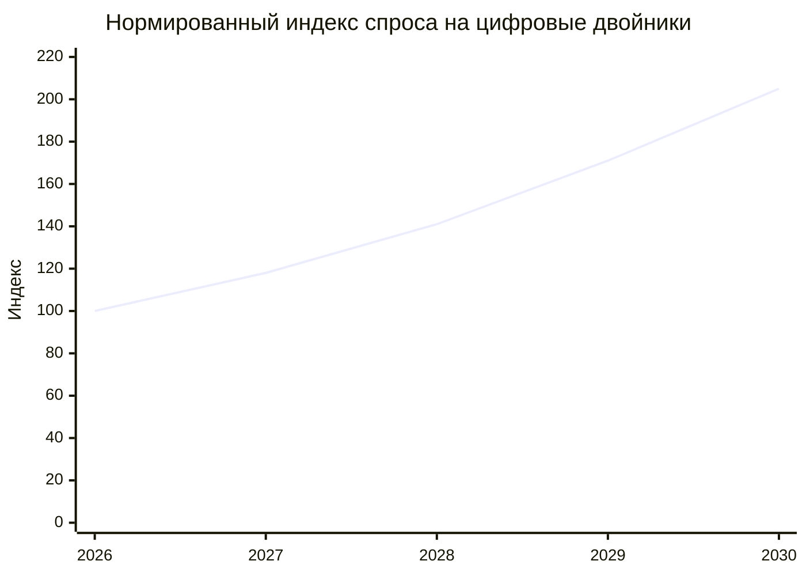
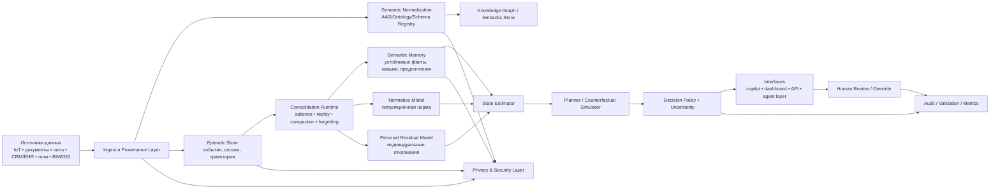

# Аналитический отчёт по цифровым двойникам, GitHub-ландшафту и нейронауке мозга

## Executive summary

Наиболее сильная инженерная позиция на июнь 2026 года выглядит так: **не пытаться строить “полную копию мозга”**, а собирать **гибридный когнитивный цифровой двойник**, который сочетает многоуровневую память, нормативную модель человека, персональный residual, контрфактическую симуляцию, явную оценку неопределённости и строгий слой валидации. Именно к такой логике одновременно подталкивают и свежие исследования по мозгу, и наиболее зрелые open-source стеки цифровых двойников. citeturn13academia0turn14academia1turn14academia3turn16academia2turn20view0turn25view0turn26view0

Ландшафт GitHub уже не выглядит как единая экосистема; это скорее **несколько сходящихся стеков**: семантическая интероперабельность и AAS, twin-state middleware, edge/IoT-интеграция, симуляция, 3D/BIM/GIS-визуализация, цифровая нить и инженерные пайплайны. Узкое ядро стандартизации остаётся сравнительно компактным: тема `asset-administration-shell` на GitHub сейчас показывает **25 публичных репозиториев**, тогда как ваш загруженный GitHub-first отчёт фиксировал для более широкого ландшафта `digital-twin` **около 938** репозиториев, что хорошо иллюстрирует разницу между «широким рынком» и «узким стандартным ядром». citeturn2view0turn0file1

По рынку на ближайшие пять лет наиболее высокий и наименее спекулятивный спрос ожидается в **B2B-индустрии, инфраструктуре, климате и государственных платформах**, а также в **медицине**, но медицина пойдёт медленнее из-за валидации, регуляторики и требований к данным. Внешние прогнозы при этом **неаддитивны** и используют разные определения «digital twin», но направление совпадает: Gartner через Axios оценивал рынок цифровых двойников в **$35 млрд в 2024 году** и **$379 млрд к 2034 году**; Wired со ссылкой на World Economic Forum писал о **$100 млрд** для industrial metaverse к 2030 году; WSJ со ссылкой на MarketsandMarkets оценивал рынок healthcare digital twins в **$1,6 млрд в 2023 году** и **$21,1 млрд к 2028 году**. citeturn10news1turn23news4turn19news4

Из ваших загруженных материалов реально уникальны **три документа**: GitHub-first обзор, обзор современных исследований мозга и концептуальный документ «От человеческого мозга к цифровому двойнику»; ещё один файл дублирует этот последний документ. Практическая ценность у них разная: GitHub-first документ полезен как карта стека и паттернов; нейронаучный документ — как база фактов и гипотез; концептуальный документ — как архитектурный манифест о том, что **сырые события нельзя напрямую превращать в идентичность**, а долговременная полезная память требует консолидации, редактируемости и управления дрейфом. fileciteturn0file1 fileciteturn0file2 fileciteturn0file0 fileciteturn0file3

## Корпус и метод

Корпус отчёта собран из трёх типов источников: официальных и первичных сайтов проектов/репозиториев GitHub, первичных либо максимально близких к первоисточнику научных публикаций и проектных страниц, а также трёх уникальных загруженных вами markdown-документов по цифровым двойникам; файл `turn0file3` содержательно дублирует `turn0file0`, поэтому в аналитике ниже он учитывается как дубликат, а не как отдельный источник новых идей. fileciteturn0file0 fileciteturn0file3

Важно отметить границу исследования. Буквальная ручная проверка **всех** репозиториев GitHub и **всех** свежих работ по мозгу в одном ответе нереалистична; поэтому здесь применён **contract-first отбор ядра**, а не попытка перечислить всё подряд. Для GitHub это означает выделение репозиториев, которые либо являются платформенным ядром twin-систем, либо закрывают ключевые архитектурные слои — AAS, device connectivity, simulation, 3D/infrastructure visualization, digital thread. Для нейронауки это означает отбор работ 2024–2026 годов, которые наиболее прямо превращаются в проектные решения для цифрового двойника: память, консолидация, забывание, принятие решений, предсказательное кодирование, нормативные модели, foundation models и ограничения поведения LLM как прокси человека. citeturn10academia7turn10academia8turn13academia0turn14academia3turn16academia2

Метод синтеза намеренно разделяет **факт**, **интерпретацию** и **гипотезу**. Факты — это подтверждённые характеристики репозиториев, публикаций и официальных проектов. Интерпретации — это выводы о зрелости, спросе и применимости. Гипотезы — это смелые, но потенциально продуктивные идеи, например purposeful forgetting как фича twin-а, нейромодуляторные control-векторы, generative AAS synthesis и global-broadcast-подход к управлению вниманием и контекстом. Там, где данных явно недостаточно, я помечаю это как «неуточнено». citeturn14academia1turn16academia3turn10academia7turn31view0

## GitHub-ландшафт цифровых двойников

Если смотреть на GitHub архитектурно, а не просто по звёздам, то картина такова. **Eclipse Ditto** даёт зрелый слой twin-state, policies, search и connectivity; **BaSyx, FAAAST и Mnestix** формируют AAS-ядро; **Shifu и Milo** закрывают device/OPC-UA интеграцию; **iTwin.js и xeokit** отвечают за инфраструктурный и 3D-визуальный слой; **CARLA, Gazebo, Chrono и PathSim** — за симуляцию и what-if; **NOS3** показывает агентский и mission-operations сценарий; **PartCAD** добавляет digital-thread логику поверх инженерного описания изделия. Это не конкурирующие проекты в лоб, а взаимодополняющие слои одного большого стека. citeturn25view0turn26view0turn2view3turn8view0turn5view0turn5view3turn4view2turn5view4turn5view6turn5view5turn27view1turn30view1turn5view8turn9view2

Особенно важен **разрыв между стандартизацией и безопасностью**. Официальный сайт IDTA уже публикует Release 25-01, где есть не только метамодель и API AAS, но и отдельная **Part 4: Security**, то есть стандартный security-layer уже оформляется. Однако README FAAAST Service для текущей релизной ветки прямо предупреждает, что сервис пока **не реализует security mechanisms** и рекомендует осторожно использовать внешние AAS-модели. Это очень практичный сигнал: рынок уже готов к интероперабельности, но open-source стек ещё не везде догнал security-by-default. citeturn4view0turn2view3

Ещё один важный вывод: наиболее зрелые проекты строят цифровой двойник не как «одну модель», а как **набор контрактных сервисов**. У Ditto это clearly separated things, policies, search, connectivity, API bindings и observability; у iTwin.js — библиотечный стек для создания, запроса, изменения и отображения infrastructure digital twins; у Shifu — отдельный DeviceShifu как atomic digital twin устройства внутри Kubernetes; у PathSim — модульное блок-схемное моделирование; у AAS-проектов — разделение на repository, registry, discovery, browser, service runtime. Это почти готовая подсказка для вашей целевой архитектуры: twin надо строить как связку bounded contexts, а не как монолит “AI + vector DB”. citeturn26view0turn4view2turn5view0turn30view1turn9view0turn8view0

| Название | Ссылка | Язык | Лицензия | Активность | Функциональность | Зрелость |
|---|---|---|---|---|---|---|
| Eclipse Ditto | GitHub / docs citeturn1view2turn25view0turn26view0 | Java, JS | EPL-2.0 | 892★, релиз 3.9.1 от 21 мая 2026 citeturn7view0 | Twin-state, policy, search, MQTT/Kafka/AMQP/HTTP, device abstraction | Высокая |
| Eclipse BaSyx Java Server SDK | GitHub citeturn1view3turn7view4 | Java | MIT | 85★, релиз 2.0.0-milestone-11 от 4 июня 2026 citeturn7view1turn7view4 | AAS-серверная экосистема, repository/registry/discovery | Средне-высокая |
| FAAAST Service | GitHub / AAS specs citeturn1view4turn4view0 | Java | Apache-2.0 | 88★, релиз 1.3.0 от 28 октября 2025 citeturn7view2turn7view5 | AAS runtime, API, synchronization with assets, CLI/Docker/embedded | Средняя |
| Mnestix Browser | GitHub citeturn8view0turn27view5 | TypeScript | MIT | 83★, релиз 2.2.0 от 12 марта 2026 citeturn27view4turn27view5 | AAS browser, dataspace navigation, discovery, mobile-friendly UX | Средняя |
| Edgenesis Shifu | GitHub citeturn4view3turn29view2 | Go | Apache-2.0 | 1.4k★, релиз v0.97.0 от 25 мая 2026 citeturn6view0turn29view2 | Kubernetes-native IoT gateway; DeviceShifu как digital twin устройства | Высокая |
| Eclipse Milo | GitHub citeturn4view4turn6view6 | Java | EPL-2.0 | 1.4k★, релиз v1.1.4 от 5 июня 2026 citeturn5view3turn6view6 | OPC UA stack + client/server SDK; критичный инфраструктурный слой | Высокая |
| iTwin.js | GitHub citeturn4view2turn5view9turn29view3 | TypeScript | MIT | 718★, активный monorepo, 21k+ commits citeturn4view2turn29view3 | Infrastructure digital twins, aggregation of engineering/IoT/GIS/reality data, 3D/4D visualization | Высокая |
| xeokit-sdk | GitHub citeturn4view5turn6view5 | JavaScript | AGPL-3.0 | 905★, релиз v2.6.111 от 27 мая 2026 citeturn5view4turn6view5 | High-detail BIM/IFC/point-cloud viewer for engineering twins | Средне-высокая |
| CARLA | GitHub citeturn4view7turn29view0 | C++, Python | MIT | 14k★, релиз 0.9.16 от 16 сентября 2025 citeturn5view6turn29view0 | AV and urban simulation; сильный what-if/sensorimotor sandbox | Высокая |
| Gazebo Sim | GitHub citeturn4view6turn29view1 | C++ | Apache-2.0 | 1.4k★, релиз Jetty 10 от 14 октября 2025 citeturn6view2turn29view1 | Robotics simulation, physics, rendering, ROS/ROS2 ecosystem | Высокая |
| Project Chrono | GitHub citeturn4view8turn27view1 | C++, Python | BSD-3-Clause | 2.9k★, релиз 10.0.0 от 7 апреля 2026 citeturn27view0turn27view1 | Multiphysics / multibody dynamics, vehicle and engineering simulation | Высокая |
| NASA NOS3 | GitHub citeturn4view9turn27view3 | неуточнено | NOSA 1.3 | 580★, релиз 1.7.4 от 19 января 2026 citeturn6view7turn27view3 | Operational simulator for space systems, I&T, mission ops, operator training | Средне-высокая |
| PathSim | GitHub / docs citeturn8view3turn30view1 | Python | MIT | 386★, релиз v0.22.2 от 27 мая 2026 citeturn30view0turn30view1 | Block-based time-domain simulation, hybrid systems, operator training | Средняя |
| PartCAD | GitHub citeturn8view2turn29view4 | Python, TS | Apache-2.0 | 468★, релиз 0.7.135 от 11 апреля 2025 citeturn9view2turn29view4 | Digital thread / manufacturable product documentation with AI hooks | Средняя |
| AASbyLLM | GitHub / IEEE Access DOI citeturn31view0 | неуточнено | CC-BY-4.0 | 17★, research prototype, 106 commits citeturn31view0 | LLM-based generation of AAS models from raw text/PDF; semantic interoperability hypothesis | Исследовательская |

**Что это значит для вашего проекта.** Базовым open-source каркасом стоит считать не один репозиторий, а сочетание: **Ditto или AAS-стек как state/semantic layer**, **Milo/Shifu как integration layer**, **Chrono/PathSim/CARLA/Gazebo как simulation layer**, **iTwin.js/xeokit как visualization layer**, плюс ваш собственный AI-слой оркестрации и memory/runtime. Такой выбор минимизирует архитектурный долг: вы наследуете зрелые паттерны, а не изобретаете всё с нуля. citeturn25view0turn26view0turn5view3turn5view0turn27view1turn30view1turn4view2turn5view4

## Свежие исследования о мозге

Наиболее полезные свежие результаты для цифрового двойника сводятся к пяти фактам. **Первое:** память мозга реконструктивна, а не файловая; следовательно, цифровой двойник должен иметь отдельный конвейер консолидации и редактируемости памяти. **Второе:** принятие решений не локализовано в одном «центре», а распределено по широким сетям; значит, twin в идеале должен принимать решения на основе общей world-state модели, а не одного policy-head. **Третье:** предсказание и prediction error — не побочный элемент, а один из основных режимов работы мозга; значит, twin должен хранить не только «что было», но и «что ожидалось». **Четвёртое:** индивидуальность лучше описывается как «норма + отклонение от нормы», чем как статичный профиль предпочтений. **Пятое:** текущие foundation-модели поведения и нейросигналов уже дают способ строить полезный surrogate без попытки эмулировать всю биологию напрямую. citeturn13academia0turn28search0turn14academia2turn14academia3turn14academia1turn14academia0turn17academia0turn16academia2

Ниже приведён **ядро корпуса** — не “все публикации вообще”, а наиболее полезные для дизайна цифрового двойника работы 2024–2026 годов. В столбце «Ссылка» использованы кликабельные цитаты.

| Название | Авторы | Год | Журнал / конференция | Краткое резюме | Ключевые выводы для twin | Ссылка |
|---|---|---:|---|---|---|---|
| Episodic memory can be encoded by the human hippocampus during infancy | Nicholas Turk-Browne и соавт. | 2025 | Science | Младенцы примерно с 12 месяцев уже показывают hippocampal-dependent encoding rudimentary episodic memories | Память возникает рано; bottleneck — не только encoding, но и post-encoding / retrieval. Для twin нужен слой консолидации, а не только запись событий | citeturn18news0 |
| Why the Brain Consolidates: Predictive Forgetting for Optimal Generalisation | Z. Fountas и соавт. | 2026 | arXiv preprint | Авторы предлагают идею predictive forgetting: selective retention улучшает generalisation bounds | **Забывание — фича**, а не баг. Для twin стоит проектировать purposeful forgetting, replay и compression | citeturn13academia0 |
| Whole-brain decision map of mice | International Brain Laboratory | 2025 | Nature | Записана активность >620k нейронов в 279 регионах во время решения задачи | Решение распределено широко; для twin нужен distributed latent state, а не «один модуль выбора» | citeturn28search0turn28news1 |
| On Predictive Planning and Counterfactual Learning in Active Inference | Aswin Paul, Takuya Isomura, Adeel Razi | 2024 | arXiv preprint | Формализуются planning и learning-from-experience в активном выводе | Twin должен сочетать online learning и counterfactual planning, а не только реактивную policy | citeturn14academia3 |
| Improving the adaptive and continuous learning capabilities of ANNs: Lessons from multi-neuromodulatory dynamics | Jie Mei и соавт. | 2025 | arXiv preprint | Обзор роли DA/ACh/5-HT/NA в гибком и непрерывном обучении | Вместо одного confidence score нужен вектор внутренних регуляторов: novelty, conflict, reward expectation, arousal | citeturn14academia1 |
| The Predictive Brain: Neural Correlates of Word Expectancy Align with LLM Prediction Probabilities | Nikola Kölbl и соавт. | 2025 | arXiv preprint | EEG/MEG в naturalistic speech показывают pre-activation и уменьшение N400 для более предсказуемых слов | Twin должен хранить prediction, surprise и error traces, а не только факт события | citeturn14academia2 |
| BrainOmni: A Brain Foundation Model for Unified EEG and MEG Signals | Qinfan Xiao и соавт. | 2025 | arXiv preprint | Foundation model на 1,997 ч EEG и 656 ч MEG | Мультимодальное представление нейросигналов уже практически возможно; это аргумент в пользу unified latent space у twin-а | citeturn13academia1 |
| Brain-OF: An Omnifunctional Foundation Model for fMRI, EEG and MEG | Hanning Guo и соавт. | 2026 | arXiv preprint | Первая unified-модель для fMRI+EEG+MEG | Инженерный смысл: у twin-а должен быть единый multimodal state backbone, а не зоопарк несвязанных моделей | citeturn13academia2 |
| MindEye2: Shared-Subject Models Enable fMRI-To-Image With 1 Hour of Data | Paul Scotti и соавт. | 2024 | arXiv preprint | Shared-subject alignment снижает потребность в персональных fMRI-данных | Для personalized twin полезен паттерн: сильная глобальная модель + лёгкая персональная донастройка | citeturn17academia1 |
| Multi-centre normative brain mapping of intracranial EEG lifespan patterns | Heather Woodhouse и соавт. | 2024 | arXiv preprint | Нормативная карта icEEG на 502 пациентах из 15 центров | Норма + персональный residual — более правильный путь, чем “one-size-fits-all profile” | citeturn14academia0 |
| GANORM: Lifespan Normative Modeling of EEG Network Topology | Shiang Hu и соавт. | 2025 | arXiv preprint | Строятся возраст-зависимые normative curves EEG network topology по данным из 9 стран | Longitudinal twin должен учитывать возраст, site-effects и deviation scores, а не только индивидуальные логи | citeturn17academia0 |
| Centaur: a foundation model of human cognition | Marcel Binz и соавт. | 2024 | arXiv preprint / далее освещён в Nature-based coverage | Модель обучена на >10 млн решений из 160 экспериментов | Поведенческий surrogate человека уже реалистичен, но это ещё не равно mechanistic twin мозга | citeturn16academia2 |
| Language Model Goal Selection Differs from Humans' in an Open-Ended Task | Gaia Molinaro и соавт. | 2026 | arXiv preprint | Современные LLM, включая Centaur, заметно расходятся с людьми в open-ended goal selection | Ключевое ограничение: нельзя безоговорочно доверять LLM как полному прокси человеческих целей | citeturn16academia0 |
| Integrated information and predictive processing theories of consciousness: An adversarial collaborative review | Andrew W. Corcoran и соавт. | 2025 | arXiv preprint | Обзор-сопоставление competing theories of consciousness в adversarial collaboration | Для twin-а полезен не “мистический слой сознания”, а функционально тестируемые механизмы global broadcast и self-monitoring | citeturn16academia1 |

Из этих работ следуют **четыре инженерно сильные гипотезы**, каждая из которых звучит смело, но практически полезна. Первая: **адаптивное забывание** должно стать базовой фичей twin-а, иначе он тонет в шуме и начинает переобучаться на прошлое. Вторая: **нейромодуляторный control vector** может быть лучшей абстракцией для переключения режимов exploration / caution / recall / persistence, чем одна температура генерации. Третья: **нормативная модель + персональный residual** почти наверняка устойчивее чисто персонализированной end-to-end модели. Четвёртая: **поведенческий twin и нейрокогнитивный twin — не одно и то же**; поэтому практичный продукт должен сначала выигрывать в поведении и предсказании решений, а не обещать “копию мозга”. citeturn13academia0turn14academia1turn14academia0turn17academia0turn16academia2turn16academia0

## Спрос и горизонты на пять лет

Рыночная картина выглядит убедительно, но только если разделять сегменты. Наиболее сильный горизонт — **B2B промышленность и инфраструктура**, где digital twin уже даёт экономику на виртуальном запуске, планировании, predictive maintenance и what-if simulation. За ним идут **государственные и межгосударственные платформы**, где спрос двигают климат, катастрофы, энергия и инфраструктурная устойчивость; яркий официальный пример — Destination Earth, который планирует к 2030 году «full digital replica of the Earth». **Медицина** растёт очень быстро, но требует жёсткой клинической валидации; при этом уже есть сильные клинические сигналы, включая персональные цифровые сердца в NEJM-освещённом пилоте Johns Hopkins. **B2C-персональные двойники** рынок тоже формирует, но сейчас он значительно более hype-sensitive и хуже верифицирован, чем B2B. citeturn20view0turn23news4turn23news0turn10news1

Глобальные оценки рынка не надо складывать между собой, потому что они измеряют разные вещи, но направление консенсусно: Gartner через Axios ожидает рост с **$35 млрд** в 2024 до **$379 млрд** к 2034; Wired со ссылкой на WEF оценивает industrial metaverse в **$100 млрд к 2030**; WSJ со ссылкой на MarketsandMarkets оценивает healthcare digital twins в **$21,1 млрд к 2028** против **$1,6 млрд** в 2023-м. Это означает не то, что “всё вырастет одинаково”, а то, что **digital twin превращается из нишевой индустриальной темы в общий операционный паттерн для сложных систем**. citeturn10news1turn23news4turn19news4

| Сегмент | Спрос сейчас | Драйвер спроса | Основной барьер | Прогноз на 5 лет |
|---|---|---|---|---|
| B2B промышленность | Очень высокий | Виртуальный запуск, оптимизация линий, data integration, quality/predictive loops citeturn23news4turn25view0turn26view0 | Интеграция OT/IT, cybersecurity, semantics | Лидер рынка |
| B2B инфраструктура и города | Высокий | BIM+GIS+IoT, 3D/4D planning, asset lifecycle, resilience citeturn4view2turn5view9turn5view4 | Разнородность данных и ownership | Быстрый рост |
| Государство и межгосударственные агентства | Высокий | Climate twins, disasters, energy, policy simulation, Earth-scale monitoring citeturn20view0turn21news2 | Стоимость вычислений, governance | Стратегический рост |
| Медицина | Высокий, но gated | Personalized treatment planning, in-silico trials, organ twins citeturn23news0turn21academia9turn23academia2 | Clinical validation, privacy, regulation | Самый высокий upside при самой высокой валидационной цене |
| Агентства, космос, миссионные системы | Средне-высокий | Mission ops, training, verification and validation, space-system simulation citeturn5view8turn27view3 | Узкие доменные требования | Стабильный рост |
| B2C персональные двойники | Средний | Persona twins, coaching, personal health/assistant experiences citeturn10news1turn16academia2 | Privacy, trust, weak validation, identity drift | Рост будет, но медленнее и неравномерно |

Ниже — **нормированный индекс спроса** по моей синтетической оценке, где 2026 = 100. Это **не опубликованный рыночный индекс**, а аналитическая нормировка на основе приведённых выше рынков, официальных дорожных карт и клинических/государственных внедрений. citeturn10news1turn23news4turn19news4turn20view0turn23news0

Стратегически это означает следующее. Если ваша цель — создать платформу, которая опирается и на digital twins, и на ваши AI-компетенции, то **самая сильная точка входа на горизонте 5 лет — B2B cognitive/operational twin**, а не consumer avatar. Наиболее продаваемая формулировка — не «цифровой двойник человека как сознания», а «персонализированный предиктивный twin для принятия решений, обучения, симуляции и ко-пилотинга». Именно так легче пройти через рынок, безопасность и доказательство ценности. citeturn23news4turn23news0turn16academia0turn16academia2

## Архитектура проекта и интеграция с вашими возможностями

**A. Система.**  
Надсистема — это ваш контур работы с AI-системами, multi-agent orchestration, RAG, архитектурой ПО и образовательными/командными процессами. Целевая система — **платформа гибридного цифрового двойника**, которая может работать в двух режимах: как twin физической/организационной системы и как twin когнитивного агента или человека. Подсистемы: ingest layer, semantic layer, episodic memory, consolidation runtime, normative model, personal residual, planner/simulator, interface layer, audit/safety layer. Границы: система не претендует на “эмуляцию мозга”, а ограничивается предиктивным, симуляционным и персонализационным контуром. Стейкхолдеры: вы как architect/operator, B2B-заказчик, domain expert, конечный пользователь, compliance/security функция и validation board. Эта постановка согласуется и с вашими файлами, и с практикой open-source digital twins. fileciteturn0file0 fileciteturn0file1 fileciteturn0file2 citeturn25view0turn26view0turn10academia7

**B. Контракты.**  
Contract-first здесь критичен.  
`Ingest Contract`: timestamped multimodal events, provenance, consent status, confidence, version.  
`Semantic Contract`: все доменные сущности проходят через нормализованный ontology/AAS-like слой, а не пишутся напрямую в память.  
`Memory Contract`: сырое событие сначала попадает в episodic store, но не становится частью identity/model без consolidation pass.  
`Model Contract`: у каждой модели есть входы/выходы, калибровка, uncertainty, drift thresholds и retrain/rollback policy.  
`Simulation Contract`: любой what-if запуск отделён от production decision path и логируется.  
`Human Oversight Contract`: high-impact decisions требуют review, override и объяснимый audit trail.  
`Privacy Contract`: чувствительные данные минимизируются, изолируются и обрабатываются по policy.  
`Validation Contract`: twin нельзя объявлять «верным», пока не пройдены fidelity, calibration, longitudinal stability и safety тесты. Эти контракты прямо следуют из обзоров по архитектуре, безопасности и приватности digital twins, а также из логики ваших загруженных материалов о памяти и идентичности. citeturn10academia7turn10academia8turn4view0turn2view3 fileciteturn0file0

**C. Архитектура.**  
Рекомендуемая архитектура для вас — **event-driven, memory-centric, multi-model**. В центре должна быть не LLM, а **Twin Runtime**: LLM — это один из оркеструемых модулей, а не вся система. Нейронаучно это ближе к связке «рабочая память + эпизодическая память + семантическая консолидация + предиктивный контроль», чем к простому “chatbot with long context”. GitHub-паттерны Ditto/AAS дают хороший внешний каркас, а свежая нейронаука — внутреннюю когнитивную логику. citeturn25view0turn26view0turn13academia0turn14academia1turn14academia3turn14academia0turn17academia0

**Требования к данным.**

| Модуль | Минимум данных | Желательно | Критично для качества |
|---|---|---|---|
| Эпизодическая память | timestamped events, session logs, actor/action/outcome | эмоции/intent/goal tags | provenance и versioning |
| Семантическая память | нормализованные сущности, glossary, ontology/AAS | graph relations, domain taxonomies | schema stability |
| Нормативная модель | популяционный baseline или cohort data | age/site/task stratification | корректные reference cohorts |
| Персональная модель | longitudinal user history | psychometrics, feedback, outcome labels | consent + drift control |
| Симуляция | causal graph, process models, constraints | physics/agent models, digital thread | валидация against reality |
| Интерфейсы | role-based views | explanation traces, scenario diffs | auditability |
| Безопасность | identity, access policy, data classification | encryption, token isolation, redaction | policy enforcement |

Эти требования не стоит трактовать как “нужно всё сразу”. Практический MVP может стартовать вообще без биосигналов и строиться на поведении, документах, агентных логах и структурированных outcome labels — а затем уже добавлять richer state variables. Это особенно хорошо согласуется с вашими компетенциями в multi-agent, RAG и системной архитектуре: у вас уже есть сильная база для semantic layer, orchestration, contracting и evaluation. citeturn16academia2turn16academia0turn10academia8

**D. Приоритет.**  
Для вас оптимальна следующая последовательность.  
Сначала — **behavioral/operational twin MVP**: события, память, консолидация, объяснимый planner, управляемая персонализация.  
Затем — **domain twin**: AAS/ontology + simulation + digital thread.  
Потом — **cognitive twin expansion**: normative model, personal residual, uncertainty modeling, longer-horizon predictions.  
И только после этого — экспериментальные слои вроде multimodal neuro-inspired state estimation или physiology-linked personalization. Такой порядок минимизирует риск и быстро даёт проверяемую ценность. fileciteturn0file0 fileciteturn0file1 fileciteturn0file2

**MVP дорожная карта.**

| Этап | Что делаем | Результат |
|---|---|---|
| Foundation | Event schema, semantic registry, episodic store, audit trail | Контролируемый ingest и воспроизводимость |
| MVP twin runtime | Retrieval, consolidation, profile graph, uncertainty-aware assistant | Поведенческий twin с длинной памятью |
| Simulation layer | Counterfactual scenarios, planner, scenario diff, policy checks | What-if engine для решений |
| Validation layer | Calibration, contradiction tests, longitudinal consistency, user fit | Измеряемая достоверность twin-а |
| Domain packaging | AAS/ontology adapters, APIs, dashboards, role views | Готовность к B2B pilot |
| Advanced R&D | Normative model, personal residual, experimental neuro-features | Версия 2 с глубокой персонализацией |

**E. Метрики успеха.**  
Ядро метрик должно быть пятислойным.  
`Memory`: retrieval precision, contradiction rate, consolidation yield, stale-memory rate.  
`Decision`: outcome uplift, counterfactual accuracy, calibration error, escalation correctness.  
`Twin fidelity`: longitudinal consistency, user-rated fit, identity drift score, goal stability.  
`Operations`: latency, cost per scenario, replay batch efficiency, observability coverage.  
`Safety`: privacy incident rate, override latency, policy violation rate, hallucination-to-action rate.  
Без этого набора twin остаётся красивой демо-системой, а не инженерной платформой. citeturn10academia7turn16academia0turn23news0

**Интеграция с вашими возможностями как ИИ и как AI-архитектора.**  
С учётом ваших компетенций наиболее естественный стек для вас — **multi-agent orchestration + RAG + semantic contracts + twin runtime + evaluation harness**. Иными словами, ваша сильная сторона не в том, чтобы «обучить ещё одну большую модель», а в том, чтобы собрать **систему контрактов и эволюции**: memory service, simulation service, policy service, evaluation board, twin ontology, and deployment playbooks. Вы можете построить платформу, где LLM — лишь рассуждающий интерфейс, а вся ценность лежит в **структуре памяти, симуляции, валидации и управлении дрейфом**. Это намного ближе к реальному окну спроса на ближайшие 5 лет, чем ставка на хайп вокруг “AGI-persona copies”. fileciteturn0file0 fileciteturn0file1 citeturn16academia0turn16academia2turn23news4

## Оценка загруженных файлов, метрики, риски и этика

Содержательно у вас сейчас не четыре, а **три уникальных документа**. Два файла — `turn0file0` и `turn0file3` — дублируют друг друга; один посвящён GitHub-ландшафту и архитектуре; один — свежим исследованиям по мозгу. В сумме они уже образуют качественную основу для будущего product thesis. fileciteturn0file0 fileciteturn0file1 fileciteturn0file2 fileciteturn0file3

| Файл | Уникальность | Сильная сторона | Спрос / применимость на 5 лет | Оценка |
|---|---|---|---|---|
| `turn0file1` GitHub-first исследование | Уникальный | Даёт карту open-source стека, стандарты, архитектурные паттерны, опорные репозитории | Очень высокая; особенно для B2B, промышленности, инфраструктуры и платформенной сборки | 9/10 fileciteturn0file1 |
| `turn0file2` исследования о мозге | Уникальный | Даёт гипотезы и факты для memory/decision/state architecture | Высокая стратегическая ценность, но прямой product ROI проявляется через архитектуру, а не через “brain copy” | 8/10 fileciteturn0file2 |
| `turn0file0` / `turn0file3` от мозга к цифровому двойнику | Уникальный по содержанию, но продублирован | Самый важный концептуальный вывод: память и идентичность нельзя строить из сырого лога; нужен слой консолидации | Очень высокая для human/cognitive twin и AI-agent OS; это почти готовая product philosophy | 9.5/10 fileciteturn0file0 fileciteturn0file3 |

Главный риск ближайших лет — **перепутать убедительность twin-а с его истинностью**. Поведенческий суррогат может выглядеть очень правдоподобно и при этом расходиться с реальными целями человека; свежая работа по open-ended goal selection прямо показывает, что даже сильные модели и даже Centaur не воспроизводят человеческий выбор целей достаточно надёжно. Поэтому high-stakes twin нельзя выпускать без fear-of-drift архитектуры, explicit uncertainty и human override. citeturn16academia0turn16academia2

Второй риск — **безопасность и приватность**. Общие обзоры цифровых двойников подчёркивают, что security/privacy — не прикладное украшение, а системная проблема IoDT-архитектур. Это подтверждается и практикой open-source: AAS security-спецификация уже опубликована IDTA, но конкретные реализации могут всё ещё отставать. Для human twin это особенно опасно, потому что память, цели, поведенческие паттерны и биосигналы — это не просто данные, а фактически операционная модель личности. citeturn10academia7turn4view0turn2view3

Третий риск — **этическая подмена субъекта**. Если twin начинает использоваться как proxy человека без ясной границы полномочий, появляются проблемы согласия, репрезентации, дискриминации и governance. В consumer-форме это выглядит как “avatar did this for you”; в enterprise-форме — как скрытая автоматизация решений; в медицине — как dangerous overtrust. Поэтому этический minimum viable set должен включать: consent boundary, revocation, provenance, role-scoped access, “simulation-not-reality” labeling, and mandatory review for high-impact actions. citeturn10academia7turn23news0turn19news4

**Открытые вопросы и ограничения.**  
Во-первых, значительная часть нейронаучного фронтира 2025–2026 всё ещё существует как сильные preprints, а не как полностью отрецензированный canon. Во-вторых, разные рыночные оценки считают разные объекты под названием “digital twin”, поэтому точные размеры рынка надо использовать как ориентир, а не как бухгалтерский факт. В-третьих, по GitHub можно уверенно выделить ядро архитектурно важных репозиториев, но нельзя честно утверждать, что один ответ исчерпывает весь мировой open-source landscape. И наконец, если ваша цель — именно twin человека, то самые большие научные пробелы сейчас не в генерации текста, а в **достоверном моделировании целей, долгой памяти, устойчивой идентичности и калиброванной неопределённости**. citeturn16academia0turn16academia2turn10news1turn10academia7

navlistСвежие материалы по рынку и внедрению цифровых двойниковturn23news0,turn21news2,turn23news4,turn10news1