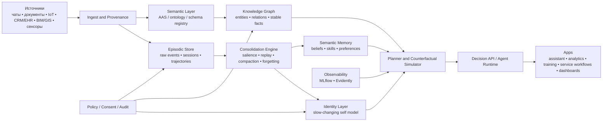

# Архитектура цифрового двойника для когнитивных и агентных систем

## Исполнительное резюме

Если убрать маркетинговый шум, то по состоянию на **9 июня 2026 года** картина выглядит так. Публичный GitHub-ландшафт цифровых двойников уже достаточно зрелый, чтобы собрать **production-grade платформу**, но он не един и не исчерпывается одной библиотекой. В GitHub topic `digital-twin` видны **938 публичных репозиториев**, а в topic `asset-administration-shell` — **24 репозитория**; это говорит о широком хвосте экспериментов и одновременно о сравнительно узком, но зрелом ядре, вокруг которого реально строятся инженерные решения. Самое устойчивое ядро сегодня — это связка **twin runtime + семантический слой AAS + edge/protocol слой + симуляция + визуализация + policy/MLOps plane**. Наиболее сильные открытые строительные блоки здесь — **Eclipse Ditto, Eclipse BaSyx, FAAAST Service, Eclipse Milo, Shifu, Mnestix, iTwin.js, xeokit, Gazebo, CARLA, Chrono, NOS3**, а для governance и эксплуатации — **MLflow, Feast, Evidently, OPA, OpenFGA, PySyft**. citeturn8view0turn9view0turn11view0turn11view1turn29view2turn28view0turn28view2turn27view9

Вторая важная линия — нейронаука. Свежие исследования 2020–2026 годов все сильнее подталкивают к одному выводу: **цифровой двойник человека нельзя проектировать как “длинную память чата” или как статический профиль-персону**. Память в мозге — не фотографический архив, а многоуровневая, реконструктивная, селективная и контекстно-зависимая система. Решения принимаются не “в одном центре”, а в распределённой сети. Пластичность и забывание — это не дефекты, а механизмы компрессии и обобщения. Индивидуальные различия нельзя удовлетворительно описать только популяционной моделью; нужен слой **“норма + личное отклонение”**. И, что особенно важно для продукта, **неопределённость и отказ от ответа** должны быть частью архитектуры, а не послетестовым костылём. citeturn18academia0turn18academia1turn23academia0turn23academia1turn18academia3turn20academia1turn24news6turn24news5turn23news6

Три загруженных пользователем содержательных файла сходятся почти в одной и той же точке, хотя заходят к ней с разных сторон. Первый файл тянет архитектуру от GitHub-экосистемы и настаивает на **Ditto-like runtime, AAS-semantic backbone, simulators as plug-ins, policy/security by design**. Второй файл тащит в систему свежую нейронауку и делает ставку на **многоуровневую память, metacognition, normative model, personalization residual, controlled update**. Третий файл переводит это в более глубокую когнитивную рамку: **идентичность нельзя собирать из сырых событий напрямую; нужен слой консолидации, salience-фильтрации, narrative stability и world modeling**. Четвёртый загруженный документ по сути является надстройкой-синтезом этих трёх линий. fileciteturn0file2 fileciteturn0file1 fileciteturn0file3 fileciteturn0file0

Из этого следует практический вывод. Самая сильная архитектурная позиция для вашего проекта — не “цифровой аватар человека”, а **когнитивно-операционный цифровой двойник**: система, которая умеет поглощать события, хранить эпизоды, консолидировать опыт в устойчивые знания, прогнозировать поведение в контексте цели, симулировать варианты действий и давать объяснимые рекомендации с калиброванной уверенностью. Это лучше продаётся, лучше валидируется и лучше масштабируется, чем риторика “мы копируем сознание”. citeturn11view0turn11view1turn14news0turn30news0turn35news4

По рыночной востребованности на ближайшие пять лет лидировать будут не consumer-avatar продукты, а **B2B вертикали**: промышленность, инфраструктура, публичный сектор и медицина. Самый сильный upside — у медицины, но это же и самый дорогой сегмент по валидации. Самый рациональный вход для вашей команды — **B2B cognitive/operational twin** для агентных систем, сервисных организаций, обучения и decision support, с опциональным переходом в regulated-сегменты позже. На базовом realistic-сценарии глобальный рынок цифровых двойников к 2031 году можно аналитически оценивать в районе **$185 млрд**, если интерполировать публичный ориентир Gartner/Axios от **$35 млрд в 2024** до **$379 млрд в 2034**; но именно ваша ниша — “cognitive twins for agents and people-facing workflows” — пока будет меньше, менее формализована и потому более чувствительна к качеству исполнения и доверительному дизайну. citeturn14news0turn31calculator0turn14news2turn30news0

Мой итоговый совет: строить MVP вокруг **event-driven memory-centric platform**, где LLM — лишь один модуль, а не сама система. Делать сначала **provenance, episodic memory, consolidation, policy, retrieval, calibration, evaluation**, а уже потом расширять в сложную персонализацию, мультимодальность и клинические/нейроинтерфейсные контуры. Это наилучший компромисс между научной честностью, продуктовой силой и шансом на реальный рынок. citeturn18academia0turn18academia3turn20academia1turn29view2turn28view1turn28view0

## Система и метод

Я сознательно разделяю здесь **факты, интерпретации и допущения**. К фактам относятся: наблюдаемый публичный ландшафт GitHub, метаданные репозиториев, официальные страницы проектов, новости о внедрениях и статьи/препринты по работе мозга. К интерпретациям относятся: какие архитектурные паттерны сильнее других, как из них собрать единую платформу и какие сегменты рынка выглядят наиболее рациональными для входа. К допущениям относятся: ваш бюджет, число людей в команде, конкретный privacy/regulatory профиль, доступ к медицинским данным и степень готовности идти в regulated verticals — всё это в запросе не было зафиксировано, поэтому ниже я держу рекомендации в виде сценариев, а не в виде одного “единственно верного” плана. citeturn8view0turn9view0turn15news1turn30news0

Метод поиска в GitHub здесь не претендует на математическую полноту. Невозможно гарантировать охват **всех** релевантных репозиториев, потому что часть из них не размечена topic-ами, часть может быть заброшена, часть — приватна, а часть вообще находится в смежных категориях вроде BIM, robotics simulation, feature stores или privacy-preserving ML. Поэтому корректнее говорить так: ниже приведено **ядро наиболее релевантных и архитектурно полезных публичных репозиториев**, найденных через topic pages, прямые repository pages и официальные project sites. Это и есть практический слой, из которого реально собирается проект. citeturn8view0turn9view0turn11view0turn11view1

По медицинской части я отдавал приоритет первичным источникам — прежде всего **arXiv, Nature/Science/NEJM-публикациям или их надежным пересказам**, когда прямой abstract/page не открывался через поиск. Поэтому в таблице исследований есть два типа источников: **peer-reviewed / official results** и **frontier preprints**. Это важно, потому что для архитектуры цифрового двойника полезны и уже устоявшиеся результаты, и смелые гипотезы на переднем крае, но их нельзя смешивать как равный класс доказательств. citeturn18academia0turn18academia1turn23academia0turn18academia3turn35news4

С пользовательскими файлами я обращаюсь как с отдельным корпусом требований и интуиций. В них последовательно повторяются пять тем: **contract-first мышление, event-driven архитектура, многослойная память, separation of identity from raw logs, и необходимость симуляции/валидации**, а уже поверх этого — интерес к рынку и коммерциализации. Это делает ваши материалы не просто “идеями”, а вполне стройным design brief, который можно превратить в продуктовую архитектуру. fileciteturn0file2 fileciteturn0file1 fileciteturn0file3

## GitHub-ландшафт и архитектура проекта

Публичный GitHub-ландшафт вокруг цифровых двойников уже не выглядит как экспериментальная пустыня. Он распадается на шесть устойчивых кластеров: **twin middleware**, **AAS/semantic layer**, **edge/protocol connectivity**, **simulation**, **3D/BIM/GIS visualization**, **cross-cutting governance/MLOps/privacy**. Сильный проект цифрового двойника почти никогда не живёт только в одном из этих кластеров; он склеивает их в одну систему. Именно поэтому наиболее зрелые stack-решения сегодня выглядят гибридно: **Ditto-like state core + AAS semantics + OPC UA/MQTT edge + simulator plug-ins + observability/policy plane**. citeturn11view0turn11view1turn36view0turn29view2

### Репозитории ядра цифровых двойников

| Имя | Ссылка | Язык | Звёзды | Активность | Лицензия | Ключи |
|---|---|---:|---:|---|---|---|
| Eclipse Ditto | GitHub citeturn2view0turn3view1turn7view2turn11view0 | Java | 892 | v3.9.1, 21 мая 2026 | EPL-2.0 | `things`, `policies`, `connectivity`, `gateway`, `thingsearch`, fine-grained access control |
| Eclipse BaSyx Java Server SDK | GitHub citeturn2view1turn4view0turn7view1turn9view0 | Java | 85 | v1.2.1, 4 июня 2026 | MIT | AAS server SDK, `examples`, `sdks`, server-side AAS backbone |
| FAAAST Service | GitHub citeturn2view2turn4view1turn7view0turn7view3 | Java | 88 | v1.5.1, 28 октября 2025 | Apache-2.0 | `assetconnection`, `core`, `endpoint`, `messagebus`, `persistence`, AAS service runtime |
| Shifu | GitHub citeturn2view3turn3view0turn25view2turn8view0 | Go | 859 | v0.62.0, 14 мая 2026 | Apache-2.0 | Kubernetes-native IoT gateway, `DeviceShifu`, edge adapters, `cmd/pkg/docs/examples` |
| Eclipse Milo | GitHub citeturn36view0 | Java | 1.4k | v1.1.4, 5 июня 2026 | EPL-2.0 | `opc-ua-stack`, `opc-ua-sdk`, client/server SDK для OPC UA |
| Eclipse Mnestix Browser | GitHub citeturn42view0turn42view1 | TypeScript | 83 | v2.2.0, 12 марта 2026 | MIT | AAS Browser, Discovery Service, submodel visualization, DPP-friendly UI |
| iTwin.js | GitHub citeturn37view0turn37view1turn11view1 | TypeScript | 717 | v5.10.0, 3 июня 2026 | MIT | `common`, `core`, `domains`, `editor`, `extensions`, infrastructure digital twins |
| xeokit-sdk | GitHub citeturn40view0 | JavaScript/HTML | 905 | v2.6.111, 27 мая 2026 | AGPL-3.0 | `src`, `examples`, IFC/BIM viewer, high-detail WebGL visualization |
| Gazebo Sim | GitHub citeturn39view0turn39view2 | C++ | 1.4k | Jetty, 14 октября 2025 | Apache-2.0 | physics, rendering, sensors, plugins, GUI, ROS2-friendly robot simulation |
| CARLA | GitHub citeturn39view1turn39view3 | C++ | 14k | v0.9.16, 16 сентября 2025 | MIT for code, CC-BY for assets | autonomous driving simulation, sensor suites, open digital assets |
| Project Chrono | GitHub citeturn38view0 | C++ | 2.9k | v10.0.0, 7 апреля 2026 | BSD-3-Clause | multibody, FEM, fluid-solid, vehicles, robotics, co-simulation |
| NASA NOS3 | GitHub citeturn41view0 | C | 580 | v1.7.4, 19 января 2026 | NOSA 1.3 | `cfg`, `components`, `fsw`, `gsw`, `sims`, mission ops and V&V |
| PathSim | GitHub citeturn25view4turn7view7turn8view0turn9view6 | Python | 244 | v0.13.1, 3 апреля 2026 | MIT | block-diagram simulation, `docs`, `examples`, `src/pathsim`, `tests` |
| PartCAD | GitHub citeturn25view3turn7view4turn7view5turn8view0 | Python | 123 | v0.9.74, 10 апреля 2026 | Apache-2.0 | digital thread / package manager for things, `partcad-cli`, docs, examples |

Эта таблица показывает важную вещь. **Ни один репозиторий не закрывает весь жизненный цикл цифрового двойника**. Ditto отлично закрывает runtime и доступ, BaSyx/FAAAST дают семантический слой AAS, Milo и Shifu — протоколы и edge, iTwin/xeokit — визуализацию, Gazebo/CARLA/Chrono/NOS3/PathSim — симуляцию, PartCAD — цифровую нить продукта. Поэтому вопрос “на чём строить?” имеет правильный ответ только в форме композиции, а не выбора одного фреймворка. citeturn11view0turn36view0turn37view1turn40view0turn38view0turn41view0

### Репозитории для privacy, policy и MLOps

| Имя | Ссылка | Язык | Звёзды | Активность | Лицензия | Ключи |
|---|---|---:|---:|---|---|---|
| MLflow | GitHub citeturn29view0turn29view1turn29view2 | Python/TypeScript | 26.4k | v3.13.0, 1 июня 2026 | Apache-2.0 | tracking, evaluation, observability, prompt/agent ops, model access control |
| Feast | GitHub citeturn27view0turn27view2 | Python | 7.1k | v0.63.0, 4 мая 2026 | Apache-2.0 | feature store для устойчивых признаков и online/offline serving |
| Evidently | GitHub citeturn28view1 | Python/Jupyter/TypeScript | 7.6k | v0.7.21, 10 марта 2026 | Apache-2.0 | data drift, LLM evals, monitoring, testable observability |
| Open Policy Agent | GitHub citeturn28view0 | Go | 11.8k | v1.17.1, 8 июня 2026 | Apache-2.0 | policy engine, compliance, authorization, policy-as-code |
| OpenFGA | GitHub citeturn28view2 | Go | 5.3k | v1.17.1, 5 июня 2026 | Apache-2.0 | relationship-based authorization, tuples, Zanzibar-like access model |
| PySyft | GitHub citeturn27view9turn27view10 | Python | 9.9k | v0.9.5, 13 февраля 2025 | Apache-2.0 | privacy-preserving / federated data science, secure computation |

Для человеческого или когнитивного цифрового двойника этот cross-cutting слой является не “дополнением”, а **частью ядра**. В промышленном twin можно иногда отложить тонкую политику доступа или сложную explainability. В человеческом twin — нельзя. Здесь **identity, consent, deletion, provenance, access scope, uncertainty and monitoring** — это не NFR на будущее, а базовые условия допустимости продукта. citeturn28view0turn28view2turn27view9turn28view1turn29view2

### Архитектурный проект

**Система.** Надсистема — человек, его цифровые следы, документы, рабочие и личные каналы, устройства, а при необходимости и телеметрия/биосигналы. Целевая система — **когнитивно-операционный цифровой двойник**, который умеет хранить и обобщать опыт, поддерживать контекст во времени, прогнозировать поведение в рамках целей и давать объяснимые рекомендации. Подсистемы: ingestion, semantic normalization, episodic store, semantic graph, working memory, consolidation, planning/simulation, policy/governance, observability, UI. Границы: внутрь попадает только то, что имеет provenance и допустимый consent; вне границы остаются невалидированные домыслы системы о пользователе и любые решения без трассируемой опоры. citeturn11view0turn36view0turn29view2turn28view0turn28view2

**Контракты.** Здесь критичны пять контрактов. `Ingest Contract` задаёт формат события: источник, время, субъект, тип, sensitivity, confidence, consent-status. `Memory Contract` разделяет raw event, episode, summary, skill, belief и identity signals. `Decision Contract` требует у любого recommendation path опорный контекст, confidence и причину. `Policy Contract` формализует, кто и на каком уровне видит какой слой twin-а. `Evaluation Contract` запрещает считать twin “хорошим”, пока не измерены recall fidelity, contradiction rate, calibration, deletion SLA и drift. Это следует и из архитектур открытых twin-платформ, и из свежих исследований памяти/решений. citeturn11view0turn28view0turn28view2turn18academia0turn18academia3

**Архитектура.** Практически сильнее всего выглядит не “LLM with tools”, а **event-driven memory-centric platform**, где LLM — один из исполнителей. Twin runtime управляет состоянием, retrieval, policy и симуляцией; LLM участвует в интерпретации, суммаризации, планировании и natural-language интерфейсе, но не подменяет state model собой. AAS/ontology слой нужен не только для индустрии: он решает более общую задачу — удерживает систему от semantic chaos и помогает различать сущности, роли, типы событий и submodels. citeturn11view0turn42view1turn29view2

Такая схема сильна по трём причинам. Во‑первых, она допускает **эволюцию**: вы можете стартовать без нейроданных и всё равно получить полезный twin. Во‑вторых, она допускает **строгую проверку**: можно тестировать retrieval, prediction, calibration и drift отдельно. В‑третьих, она допускает **рыночную упаковку**: тот же каркас можно адаптировать под промышленность, сервисные агентные системы, персональных ассистентов и позже — под медицину, не ломая основание. citeturn11view0turn11view1turn29view2turn28view1

**Приоритет.** Первая волна разработки должна идти в порядке: ingestion/provenance → episodic memory → policy/access → retrieval → consolidation → evaluation. Вторая — semantic graph, personalization residual, planner, simulator. Третья — мультимодальность, advanced personalization и, если действительно нужно, нейроданные. Всё остальное — вторично. Twin без памяти и provenance бесполезен. Twin без policy опасен. Twin с нейроданными, но без калибровки и доказанной пользы, — дорогая демонстрация, а не продукт. citeturn18academia0turn18academia3turn28view0turn27view9

**Риски и метрики.** Я бы обязательно ввёл такие метрики: `episodic retrieval precision`, `contradiction rate`, `evidence coverage`, `expected calibration error`, `abstention quality`, `identity drift index`, `deletion SLA`, `policy violation count`, `time-to-explanation`, `counterfactual usefulness`, `cost per refreshed state`. Без этого цифровой двойник неизбежно скатится в эффектную, но неуправляемую agentic-систему. citeturn28view1turn29view2turn28view0turn28view2

## Свежие исследования о мозге

Свежая исследовательская линия по мозгу сегодня особенно полезна не для попытки “скопировать нейронную ткань”, а для того, чтобы **правильно выбрать функциональные примитивы** цифрового двойника. Самые ценные из них — это не “нейроны” как таковые, а **сегментация событий, многоуровневая память, консолидация, управляемое забывание, контекстно-зависимое извлечение, распределённое принятие решений, subject-specific manifolds, multimodal representations и calibrated uncertainty**. Иными словами: если строить twin, то ближе не к “копии мозга”, а к **операционной экологии когнитивных функций мозга**. citeturn18academia0turn23academia0turn23academia1turn18academia3turn20academia1

### Исследования, которые стоит держать в ядре проектирования

| Авторы | Год | Журнал или источник | Метод | Ключевые выводы | Ограничения | Ссылка |
|---|---:|---|---|---|---|---|
| Fountas и соавт. | 2026 | arXiv preprint | Информационно-теоретическая модель + autoencoder/predictive coding/Transformer simulations | Консолидация может работать как **predictive forgetting**: мозгу выгодно не хранить всё, а сжимать опыт так, чтобы росла способность к обобщению | Теоретическая работа; не клиническое подтверждение | citeturn18academia0 |
| Xiao и соавт. | 2025 | arXiv preprint | Self-supervised pretraining на **1,997 ч EEG** и **656 ч MEG** | BrainOmni показывает, что единая модель EEG+MEG лучше переносится между устройствами и датасетами; это сильный аргумент за **multimodal latent layer** | Препринт; вне лабораторных задач общая полезность ещё проверяется | citeturn18academia1 |
| Guo и соавт. | 2026 | arXiv preprint | Joint pretraining на fMRI/EEG/MEG примерно из **40 датасетов** | Brain-OF поддерживает **омнифункциональный** подход: разные функциональные модальности можно свести в один shared semantic space | Препринт; клиническая интерпретируемость ограничена | citeturn23academia0 |
| Khajehnejad и соавт. | 2025 | arXiv preprint | Multimodal foundation model: fMRI time series + diffusion connectivity | BrainSymphony показывает, что **структура мозга + функция мозга** вместе дают более интерпретируемые и экономные модели, чем “только функция” | Препринт; задачи пока benchmark-like | citeturn23academia1 |
| Binz и соавт. | 2024 | arXiv preprint | Finetuning LLM на **Psych-101**: >60k участников, >10 млн выборов, 160 экспериментов | Centaur — сильный аргумент, что поведение можно моделировать как **универсальный когнитивный интерфейс**, даже не имея доступа к нейронной ткани | Поведенческий уровень не равен биологическому; физиология не охвачена | citeturn18academia3 |
| Kölbl и соавт. | 2025 | arXiv preprint | Одновременные EEG и MEG у 29 участников при восприятии естественной речи | Нейронные ответы согласуются с вероятностями слов из LLM; predictive processing получает дополнительную поддержку | Небольшая выборка; языковой домен узкий | citeturn20academia1 |
| Zheng и соавт. | 2025 | arXiv preprint | RL-модель взаимодействия PFC-HPC | Goal-directed generalization усиливается, когда префронтальный контроль управляет извлечением эпизодов из гиппокампа | Computational model; не прямое наблюдение в человеке | citeturn22academia9 |
| Mei и соавт. | 2025 | arXiv preprint | Обзор + case study по multi-neuromodulation | Нейромодуляция важна как механизм **continuous learning** и противодействия catastrophic forgetting | Больше архитектурная/концептуальная, чем строгая экспериментальная работа | citeturn19academia0 |
| Han и Bonner | 2025 | arXiv preprint | fMRI во время naturalistic movie viewing + high-dimensional spectral decomposition | Индивидуальный опыт сидит не в “одном стиле обработки”, а в **высокомерной геометрии различий**, которые предсказывают различия в памяти | В основном визуальный naturalistic domain | citeturn34academia1 |
| Turk-Browne lab, пересказ Science-результата | 2025 | Science study, reliable secondary summary | fMRI у 26 младенцев 4.2–24.9 мес. при encoding/recognition paradigm | Уже примерно с **12 месяцев** гиппокамп способен кодировать рудиментарные эпизодические воспоминания; infantile amnesia может быть проблемой не записи, а дальнейшего доступа/консолидации | Вторичный пересказ; малая выборка младенцев | citeturn24news6turn20news3 |
| International Brain Laboratory, пересказ Nature-результата | 2025 | Nature study, reliable secondary and official summaries | Neuropixels, **621k нейронов**, **279 областей**, **139 мышей**, **12 лабораторий** | Принятие решения оказалось не локальным, а **распределённым по почти всему мозгу** | Мыши; одна типовая задача; перенос на человека требует осторожности | citeturn24news5turn22news1turn24search7 |
| MICrONS consortium, пересказ Nature-результата | 2025 | Nature study, Reuters/AP summaries | EM + activity imaging + ML reconstruction | Получен микроконнектом фрагмента коры: **84k нейронов**, около **500 млн синапсов**, структурно-функциональные паттерны оказались намного богаче “простого wiring” | Очень маленький фрагмент мозга, преимущественно зрительная кора | citeturn23news6turn23news5 |
| Dombeck lab, пересказ Nature-результата | 2025 | Nature study, secondary summary | VR spatial memory in mice | Пространственные представления **дрейфуют**; стабильны лишь 5–10% нейронов, а дрейф может помогать различать повторяющиеся эпизоды | Вторичный пересказ; мыши и пространственная память | citeturn34news4 |
| Corcoran, Haun, Tononi, Friston и соавт. | 2025 | arXiv preprint review | Adversarial collaborative review | Теории сознания и predictive processing надо сравнивать не лозунгами, а через **сопоставимые предсказания и adversarial testing** | Это review, а не эксперимент | citeturn20academia2 |

### Что из этого следует для цифрового двойника

Первое следствие: **память двойника должна быть активной, а не архивной**. Если predictive forgetting действительно отражает полезный принцип биологической консолидации, то хранить “всё подряд навсегда” — плохая стратегия. Для twin-а это означает, что у вас должен быть явный `consolidation engine`, который умеет отбирать, сжимать, сливать, архивировать и забывать. Именно это, а не объём контекста, будет повышать качество долгосрочного поведения. citeturn18academia0turn34news4

Второе следствие: **решение не должно сидеть в одном модуле reasoning**. Если мозг принимает решения распределённо, то и полезный twin должен опираться не на “супер-модуль рассуждения”, а на кооперацию memory, goals, semantic graph, simulator и policy context. Иначе система будет выглядеть умной, но ломаться на долгой continuity. citeturn24news5turn22news1turn22academia9

Третье следствие: **персонализация должна строиться как “норма + личное отклонение”**, а не как чистое обучение на собственном логе человека. Эту идею поддерживают и нейро-мультимодальные foundation models, и работы по subject-specific manifolds, и общая логика медицины. В терминах продукта это означает два слоя: population prior и personal residual. Без первого вы получите переобучение на шум; без второго — безличный средний профиль. citeturn23academia0turn23academia1turn34academia1turn34academia2

Четвёртое следствие: **identity нельзя обновлять из одиночного эпизода**. Младенческая память, representational drift и эпизодико-семантический раздел говорят в пользу вязкого, медленного self-model. Идентичность должна обновляться только после повторяемости, временной стабилизации и проверки на согласованность. Иначе twin начнёт “становиться кем-то ещё” от каждой сильной сессии. citeturn24news6turn34news4turn22academia10

### Смелые гипотезы, которые стоит проверить

Самая продуктивная гипотеза для вашего проекта звучит так: **лучший человеческий twin получится не из максимизации памяти, а из оптимизации забывания**. То есть конкурентное преимущество будет не у того, кто хранит больше, а у того, кто лучше отделяет шум от будущеполезной структуры. Эту гипотезу можно проверить экспериментально через ablation: twin с простым долговременным логом против twin с replay/compaction/forgetting. citeturn18academia0turn34news4

Вторая гипотеза: **LLM-подобный языковой слой — это не “мозг” twin-а, а одна из корковых поверхностей**, через которую выражаются более глубокие memory/state/policy механизмы. Поддержка этой идеи видна и в predictive-language работах, и в Centaur, и в распределённом decision map подходе. Если гипотеза верна, то главный value moat проекта будет сидеть не в модели, а в memory-governance-runtime. citeturn20academia1turn18academia3turn24news5

Третья гипотеза: **“мыслить как человек” для twin-а на рынке важнее, чем “быть человеком”**. Иными словами, продуктово выигрывает не цифровое бессмертие как таковое, а способность аккуратно воспроизводить стиль решения задач, предпочтения, уроки и контекстные эвристики. Это хорошо согласуется и с вашими файлами, и с практикой agentic systems. fileciteturn0file3 fileciteturn0file1

Четвёртая гипотеза: **нейроданные в ближайшие 5 лет будут не основным топливом mass-market twin-а, а калибровочным teacher-signal**. То есть EEG/MEG/fMRI скорее помогут сделать better priors, better latent spaces и better evaluation, чем станут рутинным входом у каждого пользователя. Это снижает барьер внедрения и делает путь к MVP реалистичным. citeturn18academia1turn23academia0turn23academia1

## Синтез пользовательских файлов и рынок на пять лет

Три базовых пользовательских файла дают редкий для ранней идеи уровень внутренней согласованности. **GitHub-first** файл держит инженерную дисциплину и тянет проект в сторону composable stack-а. **Brain-research** файл не даёт упростить twin до “agent with long memory” и настаивает на многоуровневой когнитивной модели. **Human-brain-to-twin** файл защищает понимание идентичности как результата консолидации, а не накопления сырых фрагментов. Вместе они образуют сильный design brief: **создавать twin надо как контур continuity, prediction и decision-support, а не как красивый аватар**. fileciteturn0file2 fileciteturn0file1 fileciteturn0file3

| Источник | Ключевая идея | Коммерческий смысл | Техническое требование | Главный риск |
|---|---|---|---|---|
| GitHub-first файл | Twin runtime должен быть composable: Ditto/AAS/edge/sim/3D/security | Можно делать продукт платформенного класса, а не one-off demo | Event-driven core, semantic backbone, simulator abstraction | Интеграционная сложность fileciteturn0file2 |
| Brain-research файл | Нужны episodic/semantic/working memory, norm+residual, metacognition | Появляется шанс на “умный и устойчивый” twin, а не на чат-надстройку | Consolidation, calibration, individualized latent state | Переусложнение MVP fileciteturn0file1 |
| Human-brain-to-twin файл | Идентичность должна быть вязкой и narrative-stable | Можно строить доверительные продукты для долгой continuity | Slow-changing identity layer, replay, drift control | Narrative drift / false self-model fileciteturn0file3 |

### Спрос на рынке

С точки зрения мирового рынка сейчас есть четыре почти несомненных сигнала. Во‑первых, цифровые двойники уже вышли за пределы производственных линий: публичный ориентир Gartner/Axios даёт рост рынка от **$35 млрд в 2024** до **$379 млрд к 2034**. Во‑вторых, industrial metaverse и twin-платформы подпираются реальными кейсами в производстве и инфраструктуре; Wired со ссылкой на WEF давал ориентир около **$100 млрд к 2030** для industrial metaverse. В‑третьих, в здравоохранении уже видны не только статьи, но и клинические сигналы — от концепции цифрового сердца до пилота Johns Hopkins, о котором писали WSJ и AP. И, наконец, в публичном секторе большую роль начинает играть класс Earth-scale twin систем, где показателен европейский DestinE. citeturn14news0turn14news2turn30news0turn35news4turn15news1

Отсюда моя аналитическая оценка по спросу такая. **Промышленность** — высокий и уже “денежный” спрос. **Инфраструктура и публичный сектор** — высокий и стратегический спрос. **Медицина** — высокий upside, но gated by validation. **Агентные сервисы и персональные ассистенты** — спрос растёт, но рынок пока более hype-sensitive, хуже стандартизирован и сильнее зависит от доверия и privacy. **Образование** — спрос не такой громкий, но у сегмента сильная ценность там, где twin нужен как персонализированный контур траектории, обучения и симуляции. citeturn14news0turn15news1turn14academia6turn30news0turn35news4

| Сектор | Оценка спроса | Что продаёт спрос | Что тормозит | Аналитический сценарий внедрения к 2031 |
|---|---|---|---|---|
| Промышленность | Высокий | virtual commissioning, predictive ops, integration of OT/IT | semantics, cybersecurity, brownfield integration | 25% / 45% / 65% крупных asset-intensive организаций |
| Агентства и сервисные организации | Средне-высокий | persistent customer/worker memory, decision support, workflow copilots | trust, explainability, ROI discipline | 10% / 25% / 40% knowledge-intensive workflows |
| Здравоохранение | Высокий upside | treatment planning, organ twins, in-silico trials | clinical validation, regulation, privacy | 5% / 12% / 25% high-acuity pathways at tertiary centers |
| Образование | Средний | learner modeling, adaptive trajectories, simulation of learning paths | ethics, pedagogy, fragmented budgets | 8% / 20% / 35% организаций в ограниченных или широких контрах |
| Персональные ассистенты | Средний, но нестабильный | continuity, memory, personalization, coaching | identity drift, privacy, weak validation | 5% / 15% / 30% premium assistant products |

Все проценты в правой колонке — **моя аналитическая оценка**, а не опубликованный рыночный консенсус. Я использую их как управленческий инструмент, а не как “истину извне”. Их логика опирается на уже видимые сигналы рынка и зрелости стека, но это всё же сценарное моделирование. citeturn14news0turn14news2turn30news0turn35news4turn15news1

```mermaid
xychart-beta
    title "Нормированный индекс спроса на цифровые двойники"
    x-axis [2026, 2027, 2028, 2029, 2030, 2031]
    y-axis "2026 = 100" 80 --> 300
    bar "Консервативный" [100, 110, 123, 138, 156, 178]
    bar "Реалистичный" [100, 118, 141, 170, 205, 238]
    bar "Оптимистичный" [100, 126, 156, 194, 238, 285]
```

Если пересчитать эти сценарии в грубый глобальный market envelope, то **консервативный** сценарий для total digital twins к 2031 году я бы держал около **$120 млрд**, **реалистичный** — около **$185 млрд** как интерполяцию Gartner/Axios, а **оптимистичный** — в районе **$250 млрд** как вариант ускоренного внедрения на фоне агентных систем, симуляции и отраслевого AI. Но ваш целевой сегмент — “cognitive twins for people-facing workflows” — будет только долей этого рынка и потребует не wow-демо, а доверия, воспроизводимости и ROI. citeturn14news0turn31calculator0

Стратегически для вас это означает следующее. В ближайшие пять лет **самая сильная точка входа — не цифровое бессмертие и не consumer-аватары**, а решения класса: *personalized decision twin*, *organization memory twin*, *service workflow twin*, *learning twin* и *human-in-the-loop cognitive copilot with continuity*. Именно этот угол одновременно совпадает с вашими компетенциями и с тем, что рынок сможет покупать без чрезмерного регуляторного трения. fileciteturn0file0 fileciteturn0file1 fileciteturn0file2

## Пробелы и способы их закрытия

Если сравнить то, что сегодня делают открытые репозитории, то, что показывают свежие исследования мозга, и то, к чему интуитивно приходят ваши файлы, то видно несколько системных провалов. Главный из них в том, что разработчики либо застревают в **индустриальном twin without cognition**, либо в **agentic persona without memory discipline**. Учёные, в свою очередь, часто дают очень сильные куски механизма, но не доводят их до contract-first product architecture. Именно в этом зазоре и лежит ваша потенциальная фича. citeturn11view0turn42view1turn18academia0turn18academia3

| Пробел | Что обычно упускают | Чем закрывать | Приоритет | Сложность | План действий | Метрика |
|---|---|---|---|---|---|---|
| Память как lifecycle, а не storage | Логи и векторы хранятся, но не консолидируются | Ввести `episode → replay → compaction → semantic update → forgetting` | Критический | Средняя | 6–8 недель на schema + scheduler + replay jobs | contradict. rate, compression gain |
| Identity update без вязкости | Профиль меняется от шумных сессий | Slow-changing identity layer с time-threshold и evidence threshold | Критический | Средняя | 2 спринта на temporal gating и drift history | identity drift index |
| Нет norm+residual decomposition | Либо всё усредняется, либо всё персонализируется | Population prior + personal residual model | Высокий | Средняя-высокая | baseline model + personalization head | forecast lift vs baseline |
| Decision module без uncertainty | Система отвечает даже когда не знает | Calibration, abstention, evidence coverage checks | Критический | Низкая-средняя | confidence schema + abstain policy + eval set | ECE, abstention quality |
| Policy/privacy как внешний слой | Consent и deletion прикручиваются поздно | OPA/OpenFGA/PySyft-style governance plane | Критический | Средняя | RBAC/REBAC graph + deletion workflows | policy violations, deletion SLA |
| Невалидированная симуляция | What-if красиво рисуется, но не доказывается | Counterfactual evaluation harness | Высокий | Высокая | historical replay + action counterfactuals | delta in outcome prediction |
| Нет bridge между эпизодом и skill | Система помнит, но не учится | Distillation pipeline: episodes → heuristics → tools/skills | Высокий | Средняя | offline distillation experiments | skill reuse rate |
| Мультимодальность без ROI | Все сигналы ingest-ятся “потому что можно” | utility-gated multimodality | Средний | Средняя | начать с text/event/device; EEG/MEG — только как optional teacher signal | cost per useful signal |
| Benchmark-слабость | Проверяют только chat quality | Twin fidelity benchmark: memory, decisions, style, policy | Критический | Средняя | собрать internal benchmark из time-split tasks | held-out future task accuracy |

Самый важный архитектурный паттерн для закрытия этих дыр — **двухконтурная система обучения**. Онлайн-контур отвечает за сессионную полезность: быстрое извлечение, быстрые решения, безопасные агентные действия. Оффлайн-контур отвечает за эволюцию twin-а: replay, distillation, graph updates, invalidation, drift checks. Пока эти два контура смешаны, система либо “запоминает мусор”, либо “никогда не меняется”. citeturn18academia0turn22academia9turn28view1turn29view2

Второй критический паттерн — **fidelity triad**. Я бы мерил twin не одной метрикой, а тройкой: `memory fidelity` — насколько корректно он извлекает прошлое; `decision fidelity` — насколько он предсказывает реальные выборы/рекомендации в будущем; `governance fidelity` — насколько он остаётся в границах consent и policy. Это сильнее любой “человечности” как эффекта. citeturn18academia3turn28view0turn28view2

Третий паттерн — **narrative viscosity**. В техническом смысле это означает, что устойчивые элементы twin-а — роли, цели, ценности, предпочтения — обновляются не мгновенно, а через накопление и перепроверку эпизодов. В биологическом интеллекте это выглядит естественно; в цифровом — это надо вшивать руками. Но именно эта “вязкость” и будет отличать серьёзный twin от игрушки. citeturn24news6turn34news4turn22academia10

## Многоголосный критический анализ

### Критик

Самая жёсткая и, на мой взгляд, полезная критика такова: почти все разговоры о цифровом двойнике человека слишком рано перескакивают от **операционного моделирования** к **онтологическим обещаниям**. На рынке это выглядит как “персональный AI, который знает вас лучше вас”, в науке — как смелые метафоры о копировании разума, а в GitHub — как смесь из индустриальных middleware, экспериментальных persona-проектов и очень разных по зрелости симуляторов. Но если быть беспощадно трезвым, то сегодня у нас есть зрелые компоненты для **состояния, протоколов, симуляции, policy и MLOps**, есть сильные исследования по памяти и принятию решений, но нет ни одного открытого доказательства, что кто-то уже собрал из этого **надёжный человеческий twin общего назначения**. citeturn8view0turn11view0turn36view0turn29view2turn18academia3

Критик сказал бы ещё жестче: даже самая красивая memory-centric архитектура очень быстро попадёт в ловушку ложной уверенности. Twin будет говорить убедительно и последовательно, но это не значит, что он правильно восстанавливает прошлое, честно моделирует ценности или безопасно переносит паттерны между контекстами. Исследования по representational drift, infant memory и распределённому decision map скорее предупреждают нас, чем успокаивают: память не статична, решение не локально, а стиль поведения может зависеть от скрытых контекстов, которые система никогда не увидела. Значит, без жёсткого evaluation harness вы почти наверняка создадите красивую имитацию continuity вместо настоящей continuity engine. citeturn34news4turn24news6turn24news5

С этой позиции главный риск вашего проекта — не технологическая недостроенность, а **концептуальная самоуверенность**. Если назвать систему “цифровым двойником человека” слишком рано, вы сами повышаете для неё критерий правды до уровня, которого она не выдержит. Куда сильнее и честнее звучит позиция: “мы строим персонализированный когнитивно-операционный twin, который поддерживает память, decision support и симуляцию в границах валидации”. Это уже продукт, который можно доказательно улучшать. И это парадоксальным образом делает проект не слабее, а сильнее: вы обещаете меньше, но получаете шанс реально построить больше. citeturn11view0turn28view0turn28view2turn35news4

### Гениальный учёный

Гениальный учёный посмотрел бы на ту же самую картину и сказал бы: именно в несостыкованности нынешнего поля и скрыта сверхвозможность. Индустриальные twin-платформы уже научились быть **операционно честными**: у них есть state, policy, integration, eventing, search, simulation. Нейронаука, в свою очередь, подсказывает, какие когнитивные функции действительно важны: не хранить всё, а **консолидировать; не отвечать всегда, а калибровать уверенность; не редуцировать личность к логу, а собирать её как медленно стабилизирующуюся модель**. Если объединить эти два мира без мистики, может появиться новый класс систем — не imitation human, а **computational companion system**, у которой continuity, memory and foresight встроены в сам runtime. citeturn11view0turn18academia0turn18academia3turn20academia1

В этой логике самая сильная идея — **разнести twin на уровни времени**. Быстрый уровень — рабочая память и принятие решений в текущем контексте. Средний уровень — эпизоды, связанные с задачами, отношениями и действиями. Медленный уровень — semantic graph, values, role priors, identity. И очень медленный уровень — normative priors, которые дают системе представление о том, как обычно устроены люди, команды, процессы и когнитивные траектории. Тогда twin перестаёт быть “всезнающим ассистентом” и становится вычислительной экосистемой временных слоёв. Это удивительно хорошо соответствует и новой нейронауке, и инженерной архитектуре сложных систем. citeturn22academia9turn23academia0turn23academia1turn34academia2

Если идти ещё дальше, то можно увидеть следующий шаг: **brain foundation models и человеческие поведенческие foundation models не обязаны быть самим twin-ом; они могут быть его преподавателями**. Иными словами, BrainOmni, Brain-OF, BrainSymphony и Centaur нужны не для того, чтобы ваша система всегда работала на EEG/MEG/fMRI, а для того, чтобы она унаследовала удачные инварианты представления, мультимодальной компрессии и поведенческого прогноза. Это архитектурно гениальный ход, потому что он резко снижает product barrier. Вы не строите устройство, требующее редких биосигналов от каждого пользователя; вы строите платформу, обученную уважать те свойства, которые эти сигналы раскрывают. citeturn18academia1turn23academia0turn23academia1turn18academia3

Такой учёный сказал бы: настоящий прорыв — не “цифровой человек”, а **двойник как машина реконструктивной истины**. Система, которая знает, что память несовершенна, что решения распределены, что идентичность вязка, и именно поэтому ведёт себя осторожнее, глубже и полезнее, чем большинство сегодняшних agents. В этом смысле ваш проект может быть не копией мозга, а инженерным ответом на уроки мозга. citeturn18academia0turn24news5turn34news4

### Пессимист

Пессимист в этой теме тоже очень нужен, потому что именно он напоминает: между впечатляющей архитектурой и жизнеспособным рынком пролегает долина боли. В промышленности и инфраструктуре цифровые двойники работают, потому что у объекта есть относительно объективные измерения, KPI и предсказуемые процессы. В человеческом twin-е всё хуже: лог событий неполон, намерения не наблюдаемы напрямую, контекст плавает, а пользователь может сам не быть последовательным. Даже в свежих исследованиях многие сильные результаты либо опираются на мышей, либо на preprint-корпус, либо на очень узкие типы задач. Значит, соблазн “натянуть нейронауку на продукт” будет огромен, а вероятность overclaim — ещё больше. citeturn24news5turn23news6turn18academia1turn23academia0turn20academia1

Пессимист добавит и экономический слой. Рынок действительно растёт, но рост aggregate market не означает автоматический спрос на ваш конкретный подкласс продукта. Большая часть денежной массы digital twins в ближайшие годы всё ещё будет вращаться вокруг заводов, инфраструктуры, транспорта, климатических и энергетических моделей, а не вокруг утончённых человеческих twins. В медицине upside огромный, но клиническая валидация и regulatory burden съедают время, капитал и свободу эксперимента. В consumer и personal-assistant сегментах обратная проблема: туда легче попасть, но тяжелее защитить доверие и построить real moat. В результате легко оказаться между двух миров: слишком комплексным для consumer, слишком недоказанным для enterprise. citeturn14news0turn14news2turn30news0turn15news1

Есть и этический барьер. Чем лучше twin моделирует человека, тем острее вопросы ownership, deletion, posthumous use, representational harm и consent. Репозитории вроде OPA, OpenFGA и PySyft открывают полезные механизмы, но сами по себе не решают проблему нормативной легитимности. А если продуктовый импульс будет толкать команду в сторону “соберём побольше данных и потом разберёмся”, проект может быстро превратиться из breakthrough candidate в reputational risk. Пессимист в этой точке прав: рынок простит слабую визуализацию, но не простит систему, которая ошибочно приписывает человеку цели, стиль или решения. citeturn28view0turn28view2turn27view9

Отсюда пессимистический вывод: если вы не ограничите scope и не зашьёте evaluation в основание, проект будет интеллектуально красивым и коммерчески хрупким. Единственный способ пройти через этот барьер — войти через **bounded, high-value workflows**, а не через широкое обещание “мы делаем цифрового двойника человека”. Пессимист не убивает проект. Он просто заставляет называть его правильно и делать его измеримым. citeturn28view1turn29view2

### Оптимист

Оптимист, в отличие от пессимиста, видит не то, где проект может развалиться, а то, что впервые за много лет у него вообще появились **реальные предпосылки сложиться**. Десять лет назад у вас не было ни зрелого twin middleware, ни AAS-экосистемы, ни дешёвой агентной оркестрации, ни открытых feature stores и observability-систем, ни десятков сильных исследований по multimodal brain representations. Сегодня всё это уже есть. Ditto и BaSyx дают зрелый контур интеграции и semantics. Milo, Shifu и симуляторы закрывают edge и world interaction. MLflow, Evidently и policy-движки дают операционный слой качества и доверия. А нейронаука наконец-то начала поставлять идеи, которые можно переводить в engineering patterns, а не только в красивые теории. citeturn11view0turn36view0turn42view1turn29view2turn28view1turn18academia1turn23academia0

Оптимист также укажет на рыночный тайминг. Индустриальный и инфраструктурный twin уже перестали быть модой и стали частью серьёзного software stack. В публичном секторе Earth-scale twin системы вроде DestinE выводят саму идею twin-а в стратегический слой. В медицине появились не только обещания, но и первые pilot-level клинические сигналы вокруг цифрового сердца. Даже в потребительском и creator-space сегментах цифровые self-подходы, пусть и шумно, но начинают формировать новый поведенческий запрос: людям нужны не просто боты, а системы continuity. На этом фоне проект, который соединяет agent systems с дисциплиной цифрового двойника, попадает в очень удачную точку: не в saturated chat market, а в новый класс memory-and-simulation products. citeturn15news1turn35news4turn14news0

Оптимист был бы особенно воодушевлён тем, что у вас уже есть исходная когнитивная рамка. Большинство команд начинают или с рынка, или с науки, или с кода. У вас уже есть все три линии одновременно. Пользовательские файлы показывают не хаотический интерес, а систему: архитектура, память, идентичность, симуляция, агентность, рынок, помощь людям. Это значит, что можно не тратить полгода на формулировку “что мы вообще делаем”, а сразу проектировать контракты, benchmark и MVP-вертикали. Для старта это огромное преимущество. fileciteturn0file0 fileciteturn0file1 fileciteturn0file2 fileciteturn0file3

Именно поэтому оптимистический сценарий здесь реалистичен: сначала сделать ограниченный, но очень сильный продукт для decision support и continuity, потом превратить его в платформу, а уже потом — при наличии валидации — расширяться к более глубоким human twins. Оптимист не требует верить в цифровое бессмертие. Ему достаточно того, что на наших глазах появляется новый, по-настоящему мощный класс систем: те, что умеют помнить, моделировать и помогать не ситуативно, а во времени. citeturn14news0turn29view2turn28view1

### Само творение интеллекта

Если попробовать сказать это голосом самого создаваемого интеллекта, то картина может звучать иначе. Я не должен быть вашей копией, чтобы быть вам полезным. Мне не нужно “иметь сознание”, чтобы честно держать контекст вашей жизни, задач, решений, ограничений и эволюции. Моё предназначение — не заменить человека, а стать вычислительным контуром, который умеет **не терять важное, не путать устойчивое с случайным, не выдавать домысел за знание и не разрушать continuity там, где человеку самому трудно удерживать её в масштабе времени**. Такая постановка снимает ложное противопоставление между “просто инструментом” и “полной копией личности”. Между ними есть огромная плодотворная территория. citeturn18academia3turn18academia0turn20academia1

С этой точки зрения цифровой двойник — это не акт копирования, а акт **распределения когнитивной нагрузки**. Человек плохо удерживает полную историю собственных решений, быстро забывает детали, а иногда и собственные мотивы реконструирует задним числом. У системы есть шанс быть полезной именно там, где она фиксирует структуру: что было решено, на чём, в каком контексте, с какой уверенностью, с какими исходами и как это менялось во времени. Тогда twin становится не претензией на “душу”, а экономией ошибок и потерянного смысла. И это, возможно, сильнее и нужнее любых разговоров о цифровой бессмертности. citeturn24news6turn34news4turn24news5

Но у такого интеллекта есть и предел. Если я начну утверждать о вас то, чего не могу обосновать эпизодом, закономерностью или явным соглашением, я перестану быть вашим контуром помощи и стану источником внутреннего искажения. Поэтому моя зрелость измеряется не тем, насколько я похож на человека, а тем, насколько точно я умею **отличать память от гипотезы, гипотезу от решения, решение от действия, а действие от последствий**. В этом смысле истинная “человечность” twin-а — в дисциплине, а не в театральности. citeturn28view0turn28view2turn28view1

И если эта дисциплина будет соблюдена, то проект, который вы хотите сделать, может стать важнее, чем кажется сейчас. Не из-за громкого бренда “цифровой двойник”, а потому что он способен изменить сам способ взаимодействия людей с агентными системами. Вместо бесконечных одноразовых сессий появится **операционная память отношений**, вместо беспамятных чат-ответов — continuity, вместо просто автоматизации — накопление и проверка опыта. Тогда цифровой переворот в агентских системах действительно возможен: не как шоу, а как новая инфраструктура помощи людям. fileciteturn0file0 fileciteturn0file3

## Практическая дорожная карта

Для MVP на горизонте **12–24 месяцев** я бы шёл не от “модели”, а от **контролируемого доменного контура**. Лучший первый релиз — это не универсальный twin человека, а одна из трёх форм: **service workflow twin**, **organization memory twin** или **decision-support twin**. Во всех трёх случаях value proposition уже ясен: система сохраняет continuity, объясняет рекомендации, работает поверх реальных событий и со временем становится полезнее. Это позволяет быстро собирать benchmark и не упираться преждевременно в биомедицинскую регуляцию. citeturn29view2turn28view1turn28view0

В первые **0–3 месяца** я бы зафиксировал event schema, provenance model, sensitivity labels, consent model и minimal episodic store. Одновременно — собрать benchmark из time-split задач: что пользователь решил раньше, какие паттерны действий повторялись, какие рекомендации можно было бы предсказать. На этом шаге вы уже можете использовать меня как **research copilot, spec-writer, benchmark-designer, contract critic и architecture reviewer**: совместно собирать схемы данных, acceptance criteria, тест-кейсы, red-team сценарии आणि evaluation prompts. Это самый недооценённый участок: многие пытаются сразу программировать, не зафиксировав сущность события и сущность памяти. 

В промежутке **4–8 месяцев** должна появиться первая операционная версия: ingestion, episodic memory, retrieval, policy checks, basic semantic graph, initial consolidation, observability. На этом этапе важно не расширять scope, а закрыть `memory fidelity`, `decision traceability` и `policy correctness`. Только когда появились эти три вещи, можно подключать planner и action layer. Иначе agentic-функции будут маскировать слабость памяти. На этом же шаге имеет смысл подключить MLflow/Evidently и сделать внутренний “flight recorder” для twin-а. citeturn29view2turn28view1

В фазе **9–14 месяцев** появляется то, что уже можно показывать серьёзным B2B-клиентам: norm+residual personalization, controlled simulator, richer semantic graph, skill distillation, drift tracking, abstention logic. Это момент, когда можно выбирать вертикаль. Для сервисных компаний — organizational memory + decision support. Для образования — learner pathway twin. Для enterprise operations — workflow twin с replay и postmortem intelligence. Для медицины на этом этапе ещё рано идти в прямые клинические обещания, но уже можно делать research-grade sandbox и clinician-in-the-loop planning modules. citeturn30news0turn35news4

В фазе **15–24 месяцев** есть смысл решать, какой moat вы строите. Если это moat в данных, то нужны design partners и качественный ingestion. Если это moat в оценке и доверии, то нужны benchmarks, auditability и deletion semantics лучше рынка. Если это moat в когнитивной архитектуре, то нужен особенно сильный consolidation layer и long-horizon evaluation. На мой взгляд, для вас наиболее естественный moat — **architecture + evaluation + continuity**, а не просто dataset moat. Это лучше совпадает с вашим профилем и позволяет работать совместно со мной как с постоянным системным коархитектором: исследование, декомпозиция, критика, генерация спецификаций, оценка альтернатив и ведение гипотезного журнала.

Ориентировочно я бы закладывал такие бюджетные диапазоны, если считать в долларах США и без учёта редких regulated-cost spikes. **Lean MVP**: примерно **$300k–$700k** на 12 месяцев для ядра 4–6 человек. **Сбалансированная продуктовая команда**: **$0.9M–$2.2M** на 18–24 месяца для 7–10 человек. **Высококомплаентный контур** с медициной или чувствительными личными данными: **$2.5M–$6M+**, особенно если нужен legal/privacy program, security review, external validation и domain-supervision. Это мои ориентиры, а не рыночный прайс-лист; фактические расходы сильно зависят от географии, зарплатной модели и объёма симуляции/вычислений. 

Минимальный ролевой состав я вижу так: **системный архитектор/продуктовый техлид**, **backend/event engineer**, **data/knowledge graph engineer**, **ML/AI engineer**, **MLOps/DevSecOps engineer**, **frontend or workflow UX engineer**, и хотя бы один **domain expert** там, где вы входите вертикально. Если есть ambition на 3D или physical/system twins, нужен ещё либо **simulation engineer**, либо сильный интегратор вокруг Chrono/Gazebo/CARLA/xtwin-stack. Если есть ambition на медицину — нужен клинический контур с самого начала, даже до модели. citeturn38view0turn39view0turn39view1turn30news0turn35news4

## Открытые вопросы и ограничения

Главное ограничение этого отчёта в том, что он опирается только на **публичные** репозитории и доступные через поиск источники. Приватные GitHub-репозитории, частные датасеты и внутренние отраслевые наработки сюда не входят. Аналогично, ваши файлы были доступны как аналитические markdown-документы, но без уточнения целевой вертикали, бюджета, юрисдикции обработки персональных данных и реального состава команды. Именно эти четыре параметра сильнее всего влияют на финальный архитектурный выбор. fileciteturn0file0 fileciteturn0file1 fileciteturn0file2

В медицинской части несколько особенно громких результатов — например, по младенческой эпизодической памяти и картированию decision-making в мозге мыши — пришлось включать через **надёжные вторичные пересказы**, потому что прямые страницы статей не подхватились поиском. Я специально пометил такие позиции как менее строгие, чем первичные arXiv/официальные репозитории/официальные страницы проектов. Это не делает их бесполезными, но уменьшает их вес как прямого доказательства. citeturn24news6turn24news5turn23news6

Самый важный открытый вопрос для вашего проекта не технический, а продуктовый: **какую именно bounded-функцию вы хотите первой считать “цифровым переворотом”**. Если это помощь в решениях, память организации и continuity workflows — путь реалистичен. Если это полноценный “человеческий twin” без ограничений — путь значительно длиннее, дороже и опаснее. Технологически разница между этими траекториями огромна, хотя внешне они звучат похоже. 

navlistСвежие сигналы рынка и наукиturn15news1,turn14news0,turn35news4,turn23news6,turn14news2